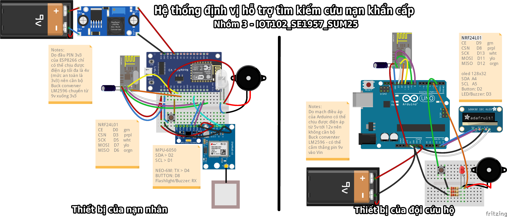
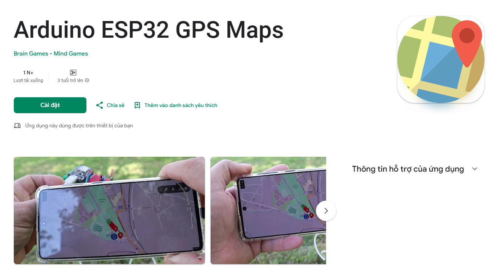
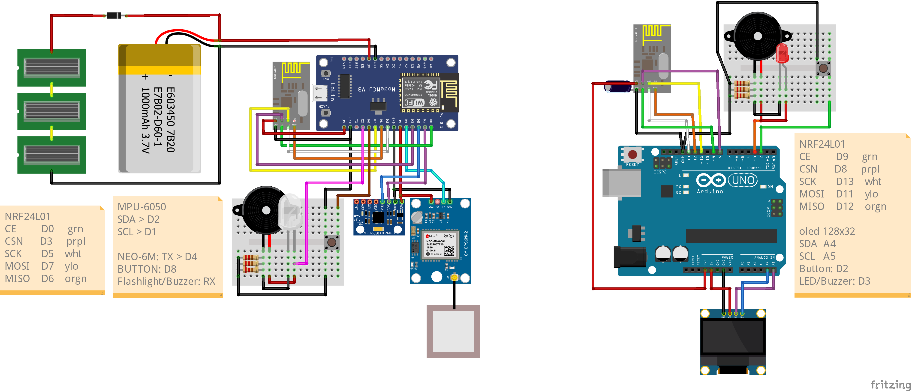

<div align="center">
  

# Final Project Nhóm 3 IOT102_SE1957_SUM25 - Hệ thống định vị hỗ trợ tìm kiếm cứu nạn khẩn cấp
</div>

<body lang=EN-US link=blue vlink=purple style='word-wrap:break-word'>

<div class=WordSection1>

<p class=MsoNormal style='line-height:normal'><b><u><span lang=vi
style='font-size:13.5pt;font-family:"Times New Roman",serif;'>I. GI&#7898;I
THI&#7878;U T&#7892;NG QUAN V&#7872; D&#7920; ÁN</span></u></b></p>

<p class=MsoNormal style='line-height:normal'><b><span lang=vi
style='font-size:13.5pt;font-family:"Times New Roman",serif;'>1.
B&#7889;i c&#7843;nh th&#7921;c ti&#7877;n</span></b></p>

<p class=MsoNormal style='line-height:normal'><span lang=vi style='font-size:
13.5pt;font-family:"Times New Roman",serif;'>Trong nh&#7919;ng
n&#259;m g&#7847;n &#273;ây, Vi&#7879;t Nam c&#361;ng nh&#432; nhi&#7873;u
qu&#7889;c gia trên th&#7871; gi&#7899;i &#273;ang ph&#7843;i &#273;&#7889;i
m&#7863;t v&#7899;i s&#7921; gia t&#259;ng v&#7873; t&#7847;n su&#7845;t và
c&#432;&#7901;ng &#273;&#7897; c&#7911;a các hi&#7879;n t&#432;&#7907;ng
th&#7901;i ti&#7871;t c&#7921;c &#273;oan. Các th&#7843;m h&#7885;a thiên nhiên
nh&#432; l&#361; quét, s&#7841;t l&#7903; &#273;&#7845;t ngày càng di&#7877;n
bi&#7871;n ph&#7913;c t&#7841;p, &#273;&#7863;c bi&#7879;t t&#7841;i các khu
v&#7921;c mi&#7873;n núi, gây ra nh&#7919;ng thi&#7879;t h&#7841;i n&#7863;ng
n&#7873; v&#7873; ng&#432;&#7901;i và tài s&#7843;n. Bên c&#7841;nh &#273;ó,
các r&#7911;i ro ti&#7873;m &#7849;n nh&#432; &#273;&#7897;ng &#273;&#7845;t,
siêu bão c&#361;ng &#273;&#7863;t ra nh&#7919;ng thách th&#7913;c l&#7899;n
&#273;&#7889;i v&#7899;i công tác phòng ch&#7889;ng và gi&#7843;m nh&#7865;
thiên tai. Th&#7921;c tr&#7841;ng này &#273;òi h&#7887;i ph&#7843;i có
nh&#7919;ng gi&#7843;i pháp công ngh&#7879; tiên ti&#7871;n &#273;&#7875;
h&#7895; tr&#7907; con ng&#432;&#7901;i trong các tình hu&#7889;ng kh&#7849;n
c&#7845;p.</span></p>

<p class=MsoNormal style='line-height:normal'><b><span lang=vi
style='font-size:13.5pt;font-family:"Times New Roman",serif;'>2.
V&#7845;n &#273;&#7873; &#273;&#7863;t ra</span></b></p>

<p class=MsoNormal style='line-height:normal'><span lang=vi style='font-size:
13.5pt;font-family:"Times New Roman",serif;'>Công tác tìm ki&#7871;m
và c&#7913;u n&#7841;n (TKCN) trong các vùng b&#7883; &#7843;nh
h&#432;&#7903;ng b&#7903;i thiên tai luôn ti&#7873;m &#7849;n nhi&#7873;u
r&#7911;i ro và thách th&#7913;c l&#7899;n:</span></p>

<ul type=disc>
 <li class=MsoNormal style=';line-height:normal'><b><span lang=vi
     style='font-size:13.5pt;font-family:"Times New Roman",serif'>&#272;&#7889;i
     v&#7899;i n&#7841;n nhân:</span></b><span lang=vi style='font-size:13.5pt;
     font-family:"Times New Roman",serif'>&nbsp;Ng&#432;&#7901;i dân &#7903;
     các khu v&#7921;c nguy hi&#7875;m, &#273;&#7863;c bi&#7879;t là vùng sâu
     vùng xa, thi&#7871;u các thi&#7871;t b&#7883; c&#7843;nh báo và
     &#273;&#7883;nh v&#7883; cá nhân chuyên d&#7909;ng. Khi s&#7921; c&#7889;
     x&#7843;y ra, h&#7885; b&#7883; cô l&#7853;p và không có kh&#7843;
     n&#259;ng thông báo v&#7883; trí chính xác c&#7911;a mình cho l&#7921;c
     l&#432;&#7907;ng c&#7913;u h&#7897;. </span><span style='font-size:13.5pt;
     font-family:"Times New Roman",serif'>(<a
     href="https://dantri.com.vn/xa-hoi/mien-tay-o-nghe-an-ngap-sau-do-anh-huong-cua-bao-wipha-20250722202401674.htm">ngu&#7891;n:
     dantri.com.vn</a>)</span></li>
 <li class=MsoNormal style=';line-height:normal'><b><span lang=vi
     style='font-size:13.5pt;font-family:"Times New Roman",serif'>&#272;&#7889;i
     v&#7899;i l&#7921;c l&#432;&#7907;ng c&#7913;u h&#7897;:</span></b><span
     lang=vi style='font-size:13.5pt;font-family:"Times New Roman",serif'>&nbsp;Các
     &#273;&#7897;i c&#7913;u h&#7897; ph&#7843;i làm vi&#7879;c trong
     &#273;i&#7873;u ki&#7879;n &#273;&#7883;a hình hi&#7875;m tr&#7903;, th&#7901;i
     ti&#7871;t kh&#7855;c nghi&#7879;t và thông tin không &#273;&#7847;y
     &#273;&#7911;. Vi&#7879;c xác &#273;&#7883;nh v&#7883; trí n&#7841;n nhân
     th&#432;&#7901;ng t&#7889;n r&#7845;t nhi&#7873;u th&#7901;i gian và công
     s&#7913;c, làm gi&#7843;m &quot;th&#7901;i gian vàng&quot; và c&#417;
     h&#7897;i s&#7889;ng sót c&#7911;a ng&#432;&#7901;i b&#7883; n&#7841;n.
     H&#417;n n&#7919;a, chính s&#7921; an toàn c&#7911;a các thành viên
     &#273;&#7897;i c&#7913;u h&#7897; c&#361;ng b&#7883; &#273;e d&#7885;a,
     th&#7921;c t&#7871; &#273;ã ghi nh&#7853;n nhi&#7873;u tr&#432;&#7901;ng
     h&#7907;p các chi&#7871;n s&#297; hy sinh trong khi làm nhi&#7879;m
     v&#7909; (</span><span lang=vi style='color:windowtext'><a
     href="https://thanhnien.vn/sat-lo-rao-trang-3-13-can-bo-hy-sinh-trong-khi-lam-nhiem-vu-tim-kiem-cuu-nan-1851002961.htm"><i><span
     style='font-size:13.5pt;font-family:"Times New Roman",serif'>ngu&#7891;n:
     thanhnien.vn</span></i></a></span><span lang=vi style='font-size:13.5pt;
     font-family:"Times New Roman",serif'>).</span></li>
 <li class=MsoNormal style=';line-height:normal'><b><span lang=vi
     style='font-size:13.5pt;font-family:"Times New Roman",serif'>V&#7873;
     ph&#432;&#417;ng ti&#7879;n liên l&#7841;c:</span></b><span lang=vi
     style='font-size:13.5pt;font-family:"Times New Roman",serif'>&nbsp;Các
     ph&#432;&#417;ng th&#7913;c liên l&#7841;c truy&#7873;n th&#7889;ng
     nh&#432; &#273;i&#7879;n tho&#7841;i di &#273;&#7897;ng hay b&#7897;
     &#273;àm th&#432;&#7901;ng m&#7845;t hi&#7879;u qu&#7843; do c&#417;
     s&#7903; h&#7841; t&#7847;ng b&#7883; phá h&#7911;y (m&#7845;t sóng,
     m&#7845;t &#273;i&#7879;n). Vi&#7879;c ph&#7889;i h&#7907;p gi&#7919;a các
     thành viên c&#7913;u h&#7897; và gi&#7919;a &#273;&#7897;i c&#7913;u
     h&#7897; v&#7899;i n&#7841;n nhân tr&#7903; nên vô cùng khó kh&#259;n.</span></li>
</ul>

<p class=MsoNormal style='line-height:normal'><b><span lang=vi
style='font-size:13.5pt;font-family:"Times New Roman",serif;'>3.
S&#7921; b&#7845;t c&#7853;p c&#7911;a các gi&#7843;i pháp hi&#7879;n t&#7841;i</span></b></p>

<p class=MsoNormal style='line-height:normal'><span lang=vi style='font-size:
13.5pt;font-family:"Times New Roman",serif;'>T&#7915; nh&#7919;ng
v&#7845;n &#273;&#7873; trên, có th&#7875; th&#7845;y rõ nh&#7919;ng b&#7845;t
c&#7853;p chính trong công tác TKCN hi&#7879;n nay:</span></p>

<ul type=disc>
 <li class=MsoNormal style=';line-height:normal'><b><span lang=vi
     style='font-size:13.5pt;font-family:"Times New Roman",serif'>Thi&#7871;u
     gi&#7843;i pháp &#273;&#7883;nh v&#7883; chuyên d&#7909;ng:</span></b><span
     lang=vi style='font-size:13.5pt;font-family:"Times New Roman",serif'>&nbsp;Ch&#432;a
     có m&#7897;t h&#7879; th&#7889;ng tích h&#7907;p cho phép xác
     &#273;&#7883;nh v&#7883; trí chính xác và t&#7913;c th&#7901;i c&#7911;a
     c&#7843; n&#7841;n nhân và thành viên &#273;&#7897;i c&#7913;u h&#7897;
     trong môi tr&#432;&#7901;ng không có sóng di &#273;&#7897;ng ho&#7863;c
     internet.</span></li>
 <li class=MsoNormal style=';line-height:normal'><b><span lang=vi
     style='font-size:13.5pt;font-family:"Times New Roman",serif'>H&#7841;n
     ch&#7871; v&#7873; kh&#7843; n&#259;ng t&#432;&#417;ng tác:</span></b><span
     lang=vi style='font-size:13.5pt;font-family:"Times New Roman",serif'>&nbsp;Vi&#7879;c
     liên l&#7841;c m&#7897;t chi&#7873;u ho&#7863;c không th&#7875; liên
     l&#7841;c làm gi&#7843;m hi&#7879;u qu&#7843; ph&#7889;i h&#7907;p,
     khi&#7871;n công tác c&#7913;u h&#7897; b&#7883; &#273;&#7897;ng và kéo
     dài.</span></li>
 <li class=MsoNormal style=';line-height:normal'><b><span lang=vi
     style='font-size:13.5pt;font-family:"Times New Roman",serif'>R&#7911;i ro
     an toàn cao:</span></b><span lang=vi style='font-size:13.5pt;font-family:
     "Times New Roman",serif'>&nbsp;L&#7921;c l&#432;&#7907;ng c&#7913;u
     h&#7897; thi&#7871;u m&#7897;t công c&#7909; giám sát v&#7883; trí
     &#273;&#7891;ng &#273;&#7897;i, làm t&#259;ng nguy c&#417; chính h&#7885;
     tr&#7903; thành n&#7841;n nhân khi có s&#7921; c&#7889; b&#7845;t
     ng&#7901; x&#7843;y ra.</span></li>
</ul>

<p class=MsoNormal style='line-height:normal'><b><span lang=vi
style='font-size:13.5pt;font-family:"Times New Roman",serif;'>4.
&#272;&#7873; xu&#7845;t gi&#7843;i pháp và m&#7909;c tiêu d&#7921; án</span></b></p>

<p class=MsoNormal style='line-height:normal'><span lang=vi style='font-size:
13.5pt;font-family:"Times New Roman",serif;'>&#272;&#7875;
gi&#7843;i quy&#7871;t nh&#7919;ng b&#7845;t c&#7853;p trên, nhóm chúng tôi
&#273;&#7873; xu&#7845;t tri&#7875;n khai d&#7921; án Internet of Things (IoT) v&#7899;i
tên g&#7885;i:</span></p>

<p class=MsoNormal style='line-height:normal'><b><span lang=vi
style='font-size:13.5pt;font-family:"Times New Roman",serif;'>“H&#7878;
TH&#7888;NG &#272;&#7882;NH V&#7882; H&#7894; TR&#7906; TÌM KI&#7870;M
C&#7912;U N&#7840;N KH&#7848;N C&#7844;P”</span></b></p>

<p class=MsoNormal style='line-height:normal'><b><span lang=vi
style='font-size:13.5pt;font-family:"Times New Roman",serif;'>M&#7909;c
tiêu chính c&#7911;a d&#7921; án:</span></b></p>

<ul type=disc>
 <li class=MsoNormal style=';line-height:normal'><b><span lang=vi
     style='font-size:13.5pt;font-family:"Times New Roman",serif'>MT1:</span></b><span
     lang=vi style='font-size:13.5pt;font-family:"Times New Roman",serif'>&nbsp;Thi&#7871;t
     k&#7871; và ch&#7871; t&#7841;o hai lo&#7841;i thi&#7871;t b&#7883; di
     &#273;&#7897;ng: m&#7897;t cho n&#7841;n nhân và m&#7897;t cho
     &#273;&#7897;i c&#7913;u h&#7897;, có kh&#7843; n&#259;ng k&#7871;t
     n&#7889;i v&#7899;i nhau không dây trong môi tr&#432;&#7901;ng không có
     c&#417; s&#7903; h&#7841; t&#7847;ng vi&#7877;n thông ho&#7863;c sóng
     vi&#7877;n thông không th&#7875; truy&#7873;n t&#7899;i, tích h&#7907;p thêm
     pin n&#259;ng l&#432;&#7907;ng m&#7863;t tr&#7901;i &#273;&#7875; kéo dài
     th&#7901;i gian ho&#7841;t &#273;&#7897;ng cho th&#7871;t b&#7883; lâu
     nh&#7845;t có th&#7875;.</span></li>
 <li class=MsoNormal style=';line-height:normal'><b><span lang=vi
     style='font-size:13.5pt;font-family:"Times New Roman",serif'>MT2:</span></b><span
     lang=vi style='font-size:13.5pt;font-family:"Times New Roman",serif'>&nbsp;Tích
     h&#7907;p các c&#7843;m bi&#7871;n (GPS, gia t&#7889;c k&#7871;)
     &#273;&#7875; t&#7921; &#273;&#7897;ng xác &#273;&#7883;nh v&#7883; trí và
     phát hi&#7879;n các tình hu&#7889;ng kh&#7849;n c&#7845;p (nh&#432;
     b&#7883; ngã) c&#7911;a n&#7841;n nhân.</span></li>
 <li class=MsoNormal style=';line-height:normal'><b><span lang=vi
     style='font-size:13.5pt;font-family:"Times New Roman",serif'>MT3:</span></b><span
     lang=vi style='font-size:13.5pt;font-family:"Times New Roman",serif'>&nbsp;Xây
     d&#7921;ng m&#7897;t kênh liên l&#7841;c hai chi&#7873;u, cho phép
     n&#7841;n nhân g&#7917;i tín hi&#7879;u c&#7847;u c&#7913;u (SOS) và
     &#273;&#7897;i c&#7913;u h&#7897; có th&#7875; g&#7917;i l&#7879;nh kích
     ho&#7841;t tín hi&#7879;u (âm thanh, ánh sáng) trên thi&#7871;t b&#7883;
     c&#7911;a n&#7841;n nhân &#273;&#7875; h&#7895; tr&#7907; &#273;&#7883;nh
     v&#7883; t&#7841;i hi&#7879;n tr&#432;&#7901;ng.</span></li>
 <li class=MsoNormal style=';line-height:normal'><b><span lang=vi
     style='font-size:13.5pt;font-family:"Times New Roman",serif'>MT4:</span></b><span
     lang=vi style='font-size:13.5pt;font-family:"Times New Roman",serif'>&nbsp;Phát
     tri&#7875;n m&#7897;t gi&#7843;i pháp b&#7843;n &#273;&#7891; ngo&#7841;i
     tuy&#7871;n (offline map) ch&#7841;y trên thi&#7871;t b&#7883; di
     &#273;&#7897;ng (&#273;i&#7879;n tho&#7841;i/laptop), giúp &#273;&#7897;i
     c&#7913;u h&#7897; theo dõi v&#7883; trí n&#7841;n nhân theo th&#7901;i
     gian th&#7921;c mà không c&#7847;n k&#7871;t n&#7889;i internet.</span></li>
</ul>

<p class=MsoNormal style='line-height:normal'><span lang=vi style='font-size:
13.5pt;font-family:"Times New Roman",serif;'>Gi&#7843;i pháp này
h&#432;&#7899;ng t&#7899;i vi&#7879;c rút ng&#7855;n &#273;áng k&#7875; th&#7901;i
gian tìm ki&#7871;m, t&#259;ng c&#417; h&#7897;i s&#7889;ng sót cho n&#7841;n
nhân, &#273;&#7891;ng th&#7901;i nâng cao hi&#7879;u qu&#7843; ph&#7889;i
h&#7907;p và &#273;&#7843;m b&#7843;o an toàn t&#7889;i &#273;a cho l&#7921;c
l&#432;&#7907;ng c&#7913;u h&#7897;.</span></p>

<p class=MsoNormal style='margin-top:12.0pt;margin-right:0in;margin-bottom:
12.0pt;margin-left:0in;line-height:197%'><b><u><span lang=vi style='font-size:
13.5pt;line-height:197%;font-family:"Times New Roman",serif;'>II. </span></u></b><b><u><span
style='font-size:13.5pt;line-height:197%;font-family:"Times New Roman",serif;
'>N&#7896;I DUNG D&#7920; ÁN</span></u></b></p>

<p class=MsoListParagraphCxSpFirst style='margin-top:12.0pt;margin-right:0in;
margin-bottom:12.0pt;margin-left:.5in;text-indent:-.25in;line-height:197%'><b><span
style='font-size:13.0pt;line-height:197%;font-family:"Times New Roman",serif;
'>1.<span style='font:7.0pt "Times New Roman"'>&nbsp;&nbsp;&nbsp;&nbsp;
</span></span></b><b><span style='font-size:13.0pt;line-height:197%;font-family:
"Times New Roman",serif;'>Lên ý t&#432;&#7903;ng</span></b></p>

<p class=MsoListParagraphCxSpMiddle style='margin-top:12.0pt;margin-right:0in;
margin-bottom:12.0pt;margin-left:.75in;text-indent:-.25in;line-height:normal'><span
style='font-size:13.0pt;font-family:"Times New Roman",serif;'>-<span
style='font:7.0pt "Times New Roman"'>&nbsp;&nbsp;&nbsp;&nbsp;&nbsp;&nbsp;&nbsp;
</span></span><span style='font-size:13.0pt;font-family:"Times New Roman",serif;
'>Thi&#7871;t k&#7871; ra 2 module giao ti&#7871;p không dây
v&#7899;i nhau b&#7857;ng sóng radio mà không ph&#7909; thu&#7897;c vào wifi
(phù h&#7907;p v&#7899;i vùng h&#7867;o lánh không có tín hi&#7879;u di
&#273;&#7897;ng)</span></p>

<p class=MsoListParagraphCxSpMiddle style='margin-top:12.0pt;margin-right:0in;
margin-bottom:12.0pt;margin-left:.75in;text-indent:-.25in;line-height:normal'><span
style='font-size:13.0pt;font-family:"Times New Roman",serif;'>-<span
style='font:7.0pt "Times New Roman"'>&nbsp;&nbsp;&nbsp;&nbsp;&nbsp;&nbsp;&nbsp;
</span></span><span style='font-size:13.0pt;font-family:"Times New Roman",serif;
'>Trên thi&#7871;t b&#7883; c&#7911;a n&#7841;n nhân tích h&#7907;p
GPS, c&#7843;m bi&#7871;n té ngã, module vô tuy&#7871;n &#273;&#7875; g&#7917;i
tín hi&#7879;u v&#7873; cho &#273;&#7897;i c&#7913;u h&#7897;, buzzer, &#273;èn
hi&#7879;u &#273;&#7875; ph&#7909;c v&#7909; cho công tác xác &#273;&#7883;nh
v&#7883; trí &#7903; c&#7921; li g&#7847;n, pin n&#259;ng l&#432;&#7907;ng
m&#7863;t tr&#7901;i cung c&#7845;p n&#259;ng l&#432;&#7907;ng liên t&#7909;c
cho pin và thi&#7871;t b&#7883;</span></p>

<p class=MsoListParagraphCxSpMiddle style='margin-top:12.0pt;margin-right:0in;
margin-bottom:12.0pt;margin-left:.75in;text-indent:-.25in;line-height:normal'><span
style='font-size:13.0pt;font-family:"Times New Roman",serif;'>-<span
style='font:7.0pt "Times New Roman"'>&nbsp;&nbsp;&nbsp;&nbsp;&nbsp;&nbsp;&nbsp;
</span></span><span style='font-size:13.0pt;font-family:"Times New Roman",serif;
'>Trên thi&#7871;t b&#7883; c&#7911;a &#273;&#7897;i c&#7913;u
h&#7897; tích h&#7907;p màn hình theo dõi các thông s&#7889;, v&#7883; trí,
module tín hi&#7879;u luôn luôn k&#7871;t n&#7889;i v&#7899;i thi&#7871;t
b&#7883; c&#7911;a n&#7841;n nhân, còi và &#273;èn hi&#7879;u kh&#7849;n c&#7845;p
khi n&#7841;n nhân g&#7917;i tín hi&#7879;u SOS</span></p>

<p class=MsoListParagraphCxSpLast style='margin-top:12.0pt;margin-right:0in;
margin-bottom:12.0pt;margin-left:.5in;text-indent:-.25in;line-height:normal'><b><span
style='font-size:13.0pt;font-family:"Times New Roman",serif;'>2.<span
style='font:7.0pt "Times New Roman"'>&nbsp;&nbsp;&nbsp;&nbsp; </span></span></b><b><span
style='font-size:13.0pt;font-family:"Times New Roman",serif;'>S&#417;
&#273;&#7891; kh&#7889;i</span></b></p>

<p class=MsoNormal style='text-indent:11.35pt;line-height:150%'><i><span
lang=vi style='font-size:13.0pt;line-height:150%;font-family:"Times New Roman",serif'></span></i></p>

<h3 style='margin-top:0in;margin-right:0in;margin-bottom:0in;margin-left:.5in;
text-indent:-.25in;line-height:150%'><b><span lang=vi style='font-size:13.0pt;
line-height:150%;font-family:"Times New Roman",serif;'>3.<span
style='font:7.0pt "Times New Roman"'>&nbsp;&nbsp;&nbsp;&nbsp; </span></span></b><b><span
lang=vi style='font-size:13.0pt;line-height:150%;font-family:"Times New Roman",serif;
'>Hardware Required&nbsp;(Linh Ki&#7879;n)</span></b></h3>

<p class=MsoNormal><span lang=vi style='font-size:13.5pt;line-height:115%;
font-family:"Times New Roman",serif'>Thi&#7871;t b&#7883; c&#7911;a n&#7841;n
nhân: </span></p>

<table class=MsoTableGrid border=1 cellspacing=0 cellpadding=0
 style='border-collapse:collapse;border:none'>
 <tr>
  <td width=200 valign=top style='width:150.3pt;border:solid windowtext 1.0pt;
  padding:0in 5.4pt 0in 5.4pt'>
  <p class=MsoNormal style='line-height:150%'><span style='font-size:13.0pt;
  line-height:150%;font-family:"Times New Roman",serif'>Tên linh ki&#7879;n</span></p>
  </td>
  <td width=200 valign=top style='width:150.3pt;border:solid windowtext 1.0pt;
  border-left:none;padding:0in 5.4pt 0in 5.4pt'>
  <p class=MsoNormal style='line-height:150%'><span style='font-size:13.0pt;
  line-height:150%;font-family:"Times New Roman",serif'>S&#7889;
  l&#432;&#7907;ng</span></p>
  </td>
  <td width=200 valign=top style='width:150.35pt;border:solid windowtext 1.0pt;
  border-left:none;padding:0in 5.4pt 0in 5.4pt'>
  <p class=MsoNormal style='line-height:150%'><span style='font-size:13.0pt;
  line-height:150%;font-family:"Times New Roman",serif'>Ch&#7913;c n&#259;ng</span></p>
  </td>
 </tr>
 <tr>
  <td width=200 valign=top style='width:150.3pt;border:solid windowtext 1.0pt;
  border-top:none;padding:0in 5.4pt 0in 5.4pt'>
  <p class=MsoNormal style='line-height:150%'><span lang=vi style='font-size:
  13.0pt;line-height:150%;font-family:"Times New Roman",serif'>ESP8266 NodeMCU
  Lua V3 CH340</span></p>
  </td>
  <td width=200 valign=top style='width:150.3pt;border-top:none;border-left:
  none;border-bottom:solid windowtext 1.0pt;border-right:solid windowtext 1.0pt;
  padding:0in 5.4pt 0in 5.4pt'>
  <p class=MsoNormal style='line-height:150%'><span style='font-size:13.0pt;
  line-height:150%;font-family:"Times New Roman",serif'>1</span></p>
  </td>
  <td width=200 valign=top style='width:150.35pt;border-top:none;border-left:
  none;border-bottom:solid windowtext 1.0pt;border-right:solid windowtext 1.0pt;
  padding:0in 5.4pt 0in 5.4pt'>
  <p class=MsoNormal style='line-height:150%'><span style='font-size:13.0pt;
  line-height:150%;font-family:"Times New Roman",serif'>M&#7841;ch
  &#273;i&#7873;u ki&#7875;n trung tâm (master)</span></p>
  </td>
 </tr>
 <tr>
  <td width=200 valign=top style='width:150.3pt;border:solid windowtext 1.0pt;
  border-top:none;padding:0in 5.4pt 0in 5.4pt'>
  <p class=MsoNormal style='line-height:150%'><span style='font-size:13.0pt;
  line-height:150%;font-family:"Times New Roman",serif'>NRF24L01</span></p>
  </td>
  <td width=200 valign=top style='width:150.3pt;border-top:none;border-left:
  none;border-bottom:solid windowtext 1.0pt;border-right:solid windowtext 1.0pt;
  padding:0in 5.4pt 0in 5.4pt'>
  <p class=MsoNormal style='line-height:150%'><span style='font-size:13.0pt;
  line-height:150%;font-family:"Times New Roman",serif'>1</span></p>
  </td>
  <td width=200 valign=top style='width:150.35pt;border-top:none;border-left:
  none;border-bottom:solid windowtext 1.0pt;border-right:solid windowtext 1.0pt;
  padding:0in 5.4pt 0in 5.4pt'>
  <p class=MsoNormal style='line-height:150%'><span style='font-size:13.0pt;
  line-height:150%;font-family:"Times New Roman",serif'>Thu/phát tín hi&#7879;u
  vô tuy&#7871;n</span></p>
  </td>
 </tr>
 <tr>
  <td width=200 valign=top style='width:150.3pt;border:solid windowtext 1.0pt;
  border-top:none;padding:0in 5.4pt 0in 5.4pt'>
  <p class=MsoNormal style='line-height:150%'><span lang=vi style='font-size:
  13.0pt;line-height:150%;font-family:"Times New Roman",serif'>GPS GY-NEO 6M V2</span></p>
  </td>
  <td width=200 valign=top style='width:150.3pt;border-top:none;border-left:
  none;border-bottom:solid windowtext 1.0pt;border-right:solid windowtext 1.0pt;
  padding:0in 5.4pt 0in 5.4pt'>
  <p class=MsoNormal style='line-height:150%'><span style='font-size:13.0pt;
  line-height:150%;font-family:"Times New Roman",serif'>1</span></p>
  </td>
  <td width=200 valign=top style='width:150.35pt;border-top:none;border-left:
  none;border-bottom:solid windowtext 1.0pt;border-right:solid windowtext 1.0pt;
  padding:0in 5.4pt 0in 5.4pt'>
  <p class=MsoNormal style='line-height:150%'><span style='font-size:13.0pt;
  line-height:150%;font-family:"Times New Roman",serif'>Thu tín thi&#7879;u GPS</span></p>
  </td>
 </tr>
 <tr>
  <td width=200 valign=top style='width:150.3pt;border:solid windowtext 1.0pt;
  border-top:none;padding:0in 5.4pt 0in 5.4pt'>
  <p class=MsoNormal style='line-height:150%'><span lang=vi style='font-size:
  13.0pt;line-height:150%;font-family:"Times New Roman",serif'>GY-521 MPU6050</span></p>
  </td>
  <td width=200 valign=top style='width:150.3pt;border-top:none;border-left:
  none;border-bottom:solid windowtext 1.0pt;border-right:solid windowtext 1.0pt;
  padding:0in 5.4pt 0in 5.4pt'>
  <p class=MsoNormal style='line-height:150%'><span style='font-size:13.0pt;
  line-height:150%;font-family:"Times New Roman",serif'>1</span></p>
  </td>
  <td width=200 valign=top style='width:150.35pt;border-top:none;border-left:
  none;border-bottom:solid windowtext 1.0pt;border-right:solid windowtext 1.0pt;
  padding:0in 5.4pt 0in 5.4pt'>
  <p class=MsoNormal style='line-height:150%'><span style='font-size:13.0pt;
  line-height:150%;font-family:"Times New Roman",serif'>C&#7843;m bi&#7871;n té
  ngã</span></p>
  </td>
 </tr>
 <tr>
  <td width=200 valign=top style='width:150.3pt;border:solid windowtext 1.0pt;
  border-top:none;padding:0in 5.4pt 0in 5.4pt'>
  <p class=MsoNormal style='line-height:150%'><span style='font-size:13.0pt;
  line-height:150%;font-family:"Times New Roman",serif'>Buzzer</span></p>
  </td>
  <td width=200 valign=top style='width:150.3pt;border-top:none;border-left:
  none;border-bottom:solid windowtext 1.0pt;border-right:solid windowtext 1.0pt;
  padding:0in 5.4pt 0in 5.4pt'>
  <p class=MsoNormal style='line-height:150%'><span style='font-size:13.0pt;
  line-height:150%;font-family:"Times New Roman",serif'>1</span></p>
  </td>
  <td width=200 valign=top style='width:150.35pt;border-top:none;border-left:
  none;border-bottom:solid windowtext 1.0pt;border-right:solid windowtext 1.0pt;
  padding:0in 5.4pt 0in 5.4pt'>
  <p class=MsoNormal style='line-height:150%'><span style='font-size:13.0pt;
  line-height:150%;font-family:"Times New Roman",serif'>Phát tín hi&#7879;u
  c&#7847;u c&#7913;u b&#7857;ng âm thanh</span></p>
  </td>
 </tr>
 <tr>
  <td width=200 valign=top style='width:150.3pt;border:solid windowtext 1.0pt;
  border-top:none;padding:0in 5.4pt 0in 5.4pt'>
  <p class=MsoNormal style='line-height:150%'><span style='font-size:13.0pt;
  line-height:150%;font-family:"Times New Roman",serif'>LED siêu sáng</span></p>
  </td>
  <td width=200 valign=top style='width:150.3pt;border-top:none;border-left:
  none;border-bottom:solid windowtext 1.0pt;border-right:solid windowtext 1.0pt;
  padding:0in 5.4pt 0in 5.4pt'>
  <p class=MsoNormal style='line-height:150%'><span style='font-size:13.0pt;
  line-height:150%;font-family:"Times New Roman",serif'>1</span></p>
  </td>
  <td width=200 valign=top style='width:150.35pt;border-top:none;border-left:
  none;border-bottom:solid windowtext 1.0pt;border-right:solid windowtext 1.0pt;
  padding:0in 5.4pt 0in 5.4pt'>
  <p class=MsoNormal style='line-height:150%'><span style='font-size:13.0pt;
  line-height:150%;font-family:"Times New Roman",serif'>Phát tín hi&#7879;u
  c&#7847;u c&#7913;u b&#7857;ng ánh sáng</span></p>
  </td>
 </tr>
 <tr>
  <td width=200 valign=top style='width:150.3pt;border:solid windowtext 1.0pt;
  border-top:none;padding:0in 5.4pt 0in 5.4pt'>
  <p class=MsoNormal style='line-height:150%'><span style='font-size:13.0pt;
  line-height:150%;font-family:"Times New Roman",serif'>Nút b&#7845;m</span></p>
  </td>
  <td width=200 valign=top style='width:150.3pt;border-top:none;border-left:
  none;border-bottom:solid windowtext 1.0pt;border-right:solid windowtext 1.0pt;
  padding:0in 5.4pt 0in 5.4pt'>
  <p class=MsoNormal style='line-height:150%'><span style='font-size:13.0pt;
  line-height:150%;font-family:"Times New Roman",serif'>1</span></p>
  </td>
  <td width=200 valign=top style='width:150.35pt;border-top:none;border-left:
  none;border-bottom:solid windowtext 1.0pt;border-right:solid windowtext 1.0pt;
  padding:0in 5.4pt 0in 5.4pt'>
  <p class=MsoNormal style='line-height:150%'><span style='font-size:13.0pt;
  line-height:150%;font-family:"Times New Roman",serif'>Phát tín hi&#7879;u SOS</span></p>
  </td>
 </tr>
 <tr>
  <td width=200 valign=top style='width:150.3pt;border:solid windowtext 1.0pt;
  border-top:none;padding:0in 5.4pt 0in 5.4pt'>
  <p class=MsoNormal style='line-height:150%'><span style='font-size:13.0pt;
  line-height:150%;font-family:"Times New Roman",serif'>Pin 3.7v</span></p>
  </td>
  <td width=200 valign=top style='width:150.3pt;border-top:none;border-left:
  none;border-bottom:solid windowtext 1.0pt;border-right:solid windowtext 1.0pt;
  padding:0in 5.4pt 0in 5.4pt'>
  <p class=MsoNormal style='line-height:150%'><span style='font-size:13.0pt;
  line-height:150%;font-family:"Times New Roman",serif'>1</span></p>
  </td>
  <td width=200 valign=top style='width:150.35pt;border-top:none;border-left:
  none;border-bottom:solid windowtext 1.0pt;border-right:solid windowtext 1.0pt;
  padding:0in 5.4pt 0in 5.4pt'>
  <p class=MsoNormal style='line-height:150%'><span lang=vi style='font-size:
  13.0pt;line-height:150%;font-family:"Times New Roman",serif'>Ngu&#7891;n
  &#273;i&#7879;n cho h&#7879; th&#7889;ng</span></p>
  </td>
 </tr>
 <tr>
  <td width=200 valign=top style='width:150.3pt;border:solid windowtext 1.0pt;
  border-top:none;padding:0in 5.4pt 0in 5.4pt'>
  <p class=MsoNormal style='line-height:150%'><span style='font-size:13.0pt;
  line-height:150%;font-family:"Times New Roman",serif'>Pin m&#7863;t
  tr&#7901;i</span></p>
  </td>
  <td width=200 valign=top style='width:150.3pt;border-top:none;border-left:
  none;border-bottom:solid windowtext 1.0pt;border-right:solid windowtext 1.0pt;
  padding:0in 5.4pt 0in 5.4pt'>
  <p class=MsoNormal style='line-height:150%'><span style='font-size:13.0pt;
  line-height:150%;font-family:"Times New Roman",serif'>1</span></p>
  </td>
  <td width=200 valign=top style='width:150.35pt;border-top:none;border-left:
  none;border-bottom:solid windowtext 1.0pt;border-right:solid windowtext 1.0pt;
  padding:0in 5.4pt 0in 5.4pt'>
  <p class=MsoNormal style='line-height:150%'><span style='font-size:13.0pt;
  line-height:150%;font-family:"Times New Roman",serif'>Duy trì ngu&#7891;n
  &#273;i&#7879;n</span></p>
  </td>
 </tr>
 <tr>
  <td width=200 valign=top style='width:150.3pt;border:solid windowtext 1.0pt;
  border-top:none;padding:0in 5.4pt 0in 5.4pt'>
  <p class=MsoNormal style='line-height:150%'><span style='font-size:13.0pt;
  line-height:150%;font-family:"Times New Roman",serif'>Schottky diode 1N5819</span></p>
  </td>
  <td width=200 valign=top style='width:150.3pt;border-top:none;border-left:
  none;border-bottom:solid windowtext 1.0pt;border-right:solid windowtext 1.0pt;
  padding:0in 5.4pt 0in 5.4pt'>
  <p class=MsoNormal style='line-height:150%'><span style='font-size:13.0pt;
  line-height:150%;font-family:"Times New Roman",serif'>1</span></p>
  </td>
  <td width=200 valign=top style='width:150.35pt;border-top:none;border-left:
  none;border-bottom:solid windowtext 1.0pt;border-right:solid windowtext 1.0pt;
  padding:0in 5.4pt 0in 5.4pt'>
  <p class=MsoNormal style='line-height:150%'><span lang=vi style='font-size:
  13.0pt;line-height:150%;font-family:"Times New Roman",serif'>Tránh dòng
  ng&#432;&#7907;c cho pin m&#7863;t tr&#7901;i</span></p>
  </td>
 </tr>
</table>

<p class=MsoNormal style='line-height:150%'><span lang=vi style='font-size:
13.0pt;line-height:150%;font-family:"Times New Roman",serif'>&nbsp;</span></p>

<p class=MsoNormal style='line-height:150%'><span lang=vi style='font-size:
13.0pt;line-height:150%;font-family:"Times New Roman",serif'>Thi&#7871;t
b&#7883; c&#7911;a &#273;&#7897;i c&#7913;u h&#7897;:</span></p>

<table class=MsoTableGrid border=1 cellspacing=0 cellpadding=0
 style='border-collapse:collapse;border:none'>
 <tr>
  <td width=200 valign=top style='width:150.3pt;border:solid windowtext 1.0pt;
  padding:0in 5.4pt 0in 5.4pt'>
  <p class=MsoNormal style='line-height:150%'><span style='font-size:13.0pt;
  line-height:150%;font-family:"Times New Roman",serif'>Tên linh ki&#7879;n</span></p>
  </td>
  <td width=200 valign=top style='width:150.3pt;border:solid windowtext 1.0pt;
  border-left:none;padding:0in 5.4pt 0in 5.4pt'>
  <p class=MsoNormal style='line-height:150%'><span style='font-size:13.0pt;
  line-height:150%;font-family:"Times New Roman",serif'>S&#7889;
  l&#432;&#7907;ng</span></p>
  </td>
  <td width=200 valign=top style='width:150.35pt;border:solid windowtext 1.0pt;
  border-left:none;padding:0in 5.4pt 0in 5.4pt'>
  <p class=MsoNormal style='line-height:150%'><span style='font-size:13.0pt;
  line-height:150%;font-family:"Times New Roman",serif'>Ch&#7913;c n&#259;ng</span></p>
  </td>
 </tr>
 <tr>
  <td width=200 valign=top style='width:150.3pt;border:solid windowtext 1.0pt;
  border-top:none;padding:0in 5.4pt 0in 5.4pt'>
  <p class=MsoNormal style='line-height:150%'><span style='font-size:13.0pt;
  line-height:150%;font-family:"Times New Roman",serif'>Arduino UNO</span></p>
  </td>
  <td width=200 valign=top style='width:150.3pt;border-top:none;border-left:
  none;border-bottom:solid windowtext 1.0pt;border-right:solid windowtext 1.0pt;
  padding:0in 5.4pt 0in 5.4pt'>
  <p class=MsoNormal style='line-height:150%'><span style='font-size:13.0pt;
  line-height:150%;font-family:"Times New Roman",serif'>1</span></p>
  </td>
  <td width=200 valign=top style='width:150.35pt;border-top:none;border-left:
  none;border-bottom:solid windowtext 1.0pt;border-right:solid windowtext 1.0pt;
  padding:0in 5.4pt 0in 5.4pt'>
  <p class=MsoNormal style='line-height:150%'><span style='font-size:13.0pt;
  line-height:150%;font-family:"Times New Roman",serif'>M&#7841;ch
  &#273;i&#7873;u ki&#7875;n trung tâm (master)</span></p>
  </td>
 </tr>
 <tr>
  <td width=200 valign=top style='width:150.3pt;border:solid windowtext 1.0pt;
  border-top:none;padding:0in 5.4pt 0in 5.4pt'>
  <p class=MsoNormal style='line-height:150%'><span style='font-size:13.0pt;
  line-height:150%;font-family:"Times New Roman",serif'>NRF24L01</span></p>
  </td>
  <td width=200 valign=top style='width:150.3pt;border-top:none;border-left:
  none;border-bottom:solid windowtext 1.0pt;border-right:solid windowtext 1.0pt;
  padding:0in 5.4pt 0in 5.4pt'>
  <p class=MsoNormal style='line-height:150%'><span style='font-size:13.0pt;
  line-height:150%;font-family:"Times New Roman",serif'>1</span></p>
  </td>
  <td width=200 valign=top style='width:150.35pt;border-top:none;border-left:
  none;border-bottom:solid windowtext 1.0pt;border-right:solid windowtext 1.0pt;
  padding:0in 5.4pt 0in 5.4pt'>
  <p class=MsoNormal style='line-height:150%'><span style='font-size:13.0pt;
  line-height:150%;font-family:"Times New Roman",serif'>Thu/phát tín hi&#7879;u
  vô tuy&#7871;n</span></p>
  </td>
 </tr>
 <tr>
  <td width=200 valign=top style='width:150.3pt;border:solid windowtext 1.0pt;
  border-top:none;padding:0in 5.4pt 0in 5.4pt'>
  <p class=MsoNormal style='line-height:150%'><span lang=vi style='font-size:
  13.0pt;line-height:150%;font-family:"Times New Roman",serif'>Màn hình Oled
  0.96 inch giao ti&#7871;p I2C</span></p>
  </td>
  <td width=200 valign=top style='width:150.3pt;border-top:none;border-left:
  none;border-bottom:solid windowtext 1.0pt;border-right:solid windowtext 1.0pt;
  padding:0in 5.4pt 0in 5.4pt'>
  <p class=MsoNormal style='line-height:150%'><span style='font-size:13.0pt;
  line-height:150%;font-family:"Times New Roman",serif'>1</span></p>
  </td>
  <td width=200 valign=top style='width:150.35pt;border-top:none;border-left:
  none;border-bottom:solid windowtext 1.0pt;border-right:solid windowtext 1.0pt;
  padding:0in 5.4pt 0in 5.4pt'>
  <p class=MsoNormal style='line-height:150%'><span style='font-size:13.0pt;
  line-height:150%;font-family:"Times New Roman",serif'>Hi&#7875;n th&#7883;
  thông tin c&#7847;n thi&#7871;t</span></p>
  </td>
 </tr>
 <tr>
  <td width=200 valign=top style='width:150.3pt;border:solid windowtext 1.0pt;
  border-top:none;padding:0in 5.4pt 0in 5.4pt'>
  <p class=MsoNormal style='line-height:150%'><span style='font-size:13.0pt;
  line-height:150%;font-family:"Times New Roman",serif'>Buzzer</span></p>
  </td>
  <td width=200 valign=top style='width:150.3pt;border-top:none;border-left:
  none;border-bottom:solid windowtext 1.0pt;border-right:solid windowtext 1.0pt;
  padding:0in 5.4pt 0in 5.4pt'>
  <p class=MsoNormal style='line-height:150%'><span style='font-size:13.0pt;
  line-height:150%;font-family:"Times New Roman",serif'>1</span></p>
  </td>
  <td width=200 valign=top style='width:150.35pt;border-top:none;border-left:
  none;border-bottom:solid windowtext 1.0pt;border-right:solid windowtext 1.0pt;
  padding:0in 5.4pt 0in 5.4pt'>
  <p class=MsoNormal style='line-height:150%'><span lang=vi style='font-size:
  13.0pt;line-height:150%;font-family:"Times New Roman",serif'>Thông báo cho
  &#273;&#7897; c&#7913;u h&#7897; b&#7857;ng âm thanh</span></p>
  </td>
 </tr>
 <tr>
  <td width=200 valign=top style='width:150.3pt;border:solid windowtext 1.0pt;
  border-top:none;padding:0in 5.4pt 0in 5.4pt'>
  <p class=MsoNormal style='line-height:150%'><span style='font-size:13.0pt;
  line-height:150%;font-family:"Times New Roman",serif'>LED &#273;&#7887;</span></p>
  </td>
  <td width=200 valign=top style='width:150.3pt;border-top:none;border-left:
  none;border-bottom:solid windowtext 1.0pt;border-right:solid windowtext 1.0pt;
  padding:0in 5.4pt 0in 5.4pt'>
  <p class=MsoNormal style='line-height:150%'><span style='font-size:13.0pt;
  line-height:150%;font-family:"Times New Roman",serif'>1</span></p>
  </td>
  <td width=200 valign=top style='width:150.35pt;border-top:none;border-left:
  none;border-bottom:solid windowtext 1.0pt;border-right:solid windowtext 1.0pt;
  padding:0in 5.4pt 0in 5.4pt'>
  <p class=MsoNormal style='line-height:150%'><span lang=vi style='font-size:
  13.0pt;line-height:150%;font-family:"Times New Roman",serif'>Nh&#7853;n
  bi&#7871;t tín hi&#7879;u c&#7847;u c&#7913;u</span></p>
  </td>
 </tr>
 <tr>
  <td width=200 valign=top style='width:150.3pt;border:solid windowtext 1.0pt;
  border-top:none;padding:0in 5.4pt 0in 5.4pt'>
  <p class=MsoNormal style='line-height:150%'><span style='font-size:13.0pt;
  line-height:150%;font-family:"Times New Roman",serif'>Nút b&#7845;m</span></p>
  </td>
  <td width=200 valign=top style='width:150.3pt;border-top:none;border-left:
  none;border-bottom:solid windowtext 1.0pt;border-right:solid windowtext 1.0pt;
  padding:0in 5.4pt 0in 5.4pt'>
  <p class=MsoNormal style='line-height:150%'><span style='font-size:13.0pt;
  line-height:150%;font-family:"Times New Roman",serif'>1</span></p>
  </td>
  <td width=200 valign=top style='width:150.35pt;border-top:none;border-left:
  none;border-bottom:solid windowtext 1.0pt;border-right:solid windowtext 1.0pt;
  padding:0in 5.4pt 0in 5.4pt'>
  <p class=MsoNormal style='line-height:150%'><span lang=vi style='font-size:
  13.0pt;line-height:150%;font-family:"Times New Roman",serif'>Kích ho&#7841;t
  Flashligh/Buzzer trên thi&#7871;t b&#7883; c&#7911;a n&#7841;n nhân</span></p>
  </td>
 </tr>
</table>


## Brain dump test ý tưởng
[Canva whiteboard ideas dump link](https://www.canva.com/design/DAGqHmEINVc/SHOX6dJeYkdIJgKQLLeZ7g/edit?utm_content=DAGqHmEINVc&utm_campaign=designshare&utm_medium=link2&utm_source=sharebutton)

## Sơ đồ Wiring cho 2 module

</body>

## Chức năng ngoài:
- Kết nối với app trên điện thoại thông qua OTG USB
- Chức năng : hình ảnh trực qua gps trên map
- Giao thức: Đọc tín hiệu serial gửi từ arduino qua OTG USB


- Logic giao tiếp qua serial:

```cpp
---
// The script is written by Slavko Zdravevski
// If you want to support my work, you can subscribe to my youtube channel: https://bit.ly/3FG9hpK
// I do a lot of interesting things in my free time, so you might find something of your interest or we can exchange ideas and knowledge

//The script works in combination with my android app. If you are using a GPS module with your microcontroller, you might wanna visualize the data that the module returns
//If that's the case you can use my app, and change the serial commands with the data that your module will give you
void setup() {
  Serial.begin(115200);
}

void loop() {
  //I just wrote a random map point, just to show you how it works, change the code and send your coordinates to the phone
  Serial.write("41.037806805413965,21.34574775323119|"); //My app expects: "latitude,longitude|" do not forget the "|" after the coordinates
  Serial.flush();
  delay(5000);
  Serial.write("41.03511284027609,21.339848139262262|");
  Serial.flush();
  delay(5000);
  Serial.write("41.032318982233626,21.335615232425358|");
  Serial.flush();
  delay(5000);
  Serial.write("41.03178015306117,21.330191820376996|");
  Serial.flush();
  delay(5000);
  Serial.write("41.03215932956679,21.322149297386886|");
  Serial.flush();
  delay(5000);
  Serial.write("41.03285780691883,21.316170316308956|");
  Serial.flush();
  delay(5000);
}
---
```

### App dùng để debug OTG USB


- Định dạng serial đầu ra đúng:

```
---

23:31:24.586 USB device detected
23:32:26.773 Connected to CDC device
23:32:26.774 �^K"Receiver V11 (App Compatible Mode) Initialized
23:32:30.035
21.480000,108.380000|21.480000,555.380000|
21.480015,108.380035|21.480015,555.380035|
21.480031,108.380072|21.480031,555.380072|
21.480048,108.380111|21.480048,555.380111|
21.480066,108.380152|21.480066,555.380152|
21.480085,108.380195|21.480085,555.380195|
21.480105,108.380240|21.480105,555.380240|
21.480126,108.380287|21.480126,555.380287|
21.480148,108.380336|21.480148,555.380336|
21.480171,108.380387|21.480171,555.380387|
21.480195,108.380440|21.480195,555.380440|
21.480220,108.380495|21.480220,555.380495|
21.480246,108.380552|21.480246,555.380552|
21.480273,108.380611|21.480273,555.380611|
21.480301,108.380672|21.480301,555.380672|
23:32:53.932 Disconnected

---
```


## Thực hiện chính thức

<h3 style='margin:0in;text-indent:11.35pt;line-height:150%'><b><span
style='font-size:13.0pt;line-height:150%;font-family:"Times New Roman",serif;
'>4</span></b><b><span lang=vi style='font-size:13.0pt;line-height:
150%;font-family:"Times New Roman",serif;'>. Electronic circuit
(M&#7841;ch &#273;i&#7879;n t&#7917;)</span></b></h3>

<p class=MsoNormal style='text-indent:11.35pt;line-height:150%'><span lang=vi
style='font-size:13.0pt;line-height:150%;font-family:"Times New Roman",serif;
color:#4F4E4E'></span><span lang=vi style='font-size:
13.0pt;line-height:150%;font-family:"Times New Roman",serif;color:#4F4E4E'> </span></p>

<p class=MsoNormal align=center style='text-align:center;text-indent:11.35pt;
line-height:150%'><i><span lang=vi style='font-size:13.0pt;line-height:150%;
font-family:"Times New Roman",serif'>Thi&#7871;t b&#7883; c&#7911;a n&#7841;n
nhân                                                    Thi&#7871;t b&#7883;
c&#7911;a &#273;&#7897;i c&#7913;u h&#7897;</span></i></p>

<h3 style='margin:0in;text-indent:11.35pt;line-height:150%'><b><span
style='font-size:13.0pt;line-height:150%;font-family:"Times New Roman",serif;
'></span></b><b><span lang=vi style='font-size:13.0pt;line-height:
150%;font-family:"Times New Roman",serif;'>Thiết kế thêm một app Nodejs sử dung Electron để đọc đầu ra từ serial và hiển thị lên map</span></b></h3>
<p class=MsoNormal style='text-indent:11.35pt;line-height:150%'><span lang=vi
style='font-size:13.0pt;line-height:150%;font-family:"Times New Roman",serif;
color:#4F4E4E'></span><span lang=vi style='font-size:
13.0pt;line-height:150%;font-family:"Times New Roman",serif;color:#4F4E4E'> </span></p>

<h3 style='margin:0in;text-indent:11.35pt;line-height:150%'><b><span
style='font-size:13.0pt;line-height:150%;font-family:"Times New Roman",serif;
'></span></b><b><span lang=vi style='font-size:13.0pt;line-height:
150%;font-family:"Times New Roman",serif;'>Sửa đổi code in ra Serial của arduino</span></b></h3>

```cpp
// --- UPDATED: This function now sends the full victim data packet ---
void sendVictimDataToNodeApp() {
  if (victimDataPacket.latitude != 0.0) {
    // New Format: "GPS_DATA:lat,lng,sos_state,fall_state|"
    String appData = "GPS_DATA:";
    appData += String(victimDataPacket.latitude, 6);
    appData += ",";
    appData += String(victimDataPacket.longitude, 6);
    appData += ",";
    appData += victimDataPacket.isSosSignal ? "1" : "0";
    appData += ",";
    appData += victimDataPacket.isFallDetected ? "1" : "0";
    appData += "|";
    
    // Send the raw string using print(), not println()
    Serial.print(appData);
    Serial.flush();
  }
}
```

<h3 style='margin:0in;text-indent:11.35pt;line-height:150%'><b><span
style='font-size:13.0pt;line-height:150%;font-family:"Times New Roman",serif;
'></span></b><b><span lang=vi style='font-size:13.0pt;line-height:
150%;font-family:"Times New Roman",serif;'>Đầu ra sẽ có dạng:</span></b></h3>

```
---

23:31:24.586 USB device detected
23:32:26.773 Connected to CDC device
23:32:26.774 �^K"Receiver V11 (App Compatible Mode) Initialized
23:32:30.035
21.480000,108.380000,0,0|21.480000,555.380000,0,0|
21.480015,108.380035,0,0|21.480015,555.380035,0,0|
21.480031,108.380072,0,0|21.480031,555.380072,0,0|
21.480048,108.380111,0,0|21.480048,555.380111,0,0|
23:32:53.932 Disconnected

---
```

<h3><strong><u><span lang=vi style=''>III. TH&#7920;C NGHI&#7878;M
VÀ MÔ PH&#7886;NG</span></u></strong></h3>

<p><strong><span lang=vi style='font-size:13.5pt;'>1. Mô t&#7843;
môi tr&#432;&#7901;ng và thi&#7871;t b&#7883; th&#7921;c nghi&#7879;m</span></strong></p>

<p><span lang=vi style='font-size:13.5pt;'>&#272;&#7875; ki&#7875;m
ch&#7913;ng tính n&#259;ng và &#273;&#7897; &#7893;n &#273;&#7883;nh c&#7911;a
h&#7879; th&#7889;ng, nhóm &#273;ã ti&#7871;n hành th&#7921;c nghi&#7879;m
trong môi tr&#432;&#7901;ng mô ph&#7887;ng các &#273;i&#7873;u ki&#7879;n th&#7921;c
t&#7871;.</span></p>

<p style='margin-left:.5in;text-indent:-.25in'><span style='font-size:10.0pt;
font-family:Symbol;'>·<span style='font:7.0pt "Times New Roman"'>&nbsp;&nbsp;&nbsp;&nbsp;&nbsp;&nbsp;&nbsp;
</span></span><strong><span style='font-size:13.5pt;'>Môi
tr&#432;&#7901;ng th&#7921;c nghi&#7879;m:</span></strong></p>

<ul type=disc>
 <ul type=circle>
  <li class=MsoNormal style=';line-height:normal'><strong><span
      lang=vi style='font-size:13.5pt'>Không gian:</span></strong><span
      lang=vi style='font-size:13.5pt;font-family:"Times New Roman",serif'>&nbsp;Th&#7917;
      nghi&#7879;m &#273;&#432;&#7907;c th&#7921;c hi&#7879;n t&#7841;i khu v&#7921;c
      ngoài tr&#7901;i, có không gian m&#7903; &#273;&#7875; &#273;&#7843;m b&#7843;o
      module GPS có th&#7875; nh&#7853;n tín hi&#7879;u t&#7889;t t&#7915; các
      v&#7879; tinh.</span></li>
  <li class=MsoNormal style=';line-height:normal'><strong><span
      lang=vi style='font-size:13.5pt'>Kho&#7843;ng cách:</span></strong><span
      lang=vi style='font-size:13.5pt;font-family:"Times New Roman",serif'>&nbsp;Hai
      thi&#7871;t b&#7883; &#273;&#432;&#7907;c &#273;&#7863;t cách nhau t&#7915;
      5 &#273;&#7871;n 50 mét &#273;&#7875; ki&#7875;m tra kh&#7843; n&#259;ng truy&#7873;n
      nh&#7853;n tín hi&#7879;u không dây c&#7911;a module NRF24L01.</span></li>
  <li class=MsoNormal style=';line-height:normal'><strong><span
      lang=vi style='font-size:13.5pt'>Ngu&#7891;n &#273;i&#7879;n:</span></strong><span
      lang=vi style='font-size:13.5pt;font-family:"Times New Roman",serif'>&nbsp;Thi&#7871;t
      b&#7883; c&#7911;a n&#7841;n nhân s&#7917; d&#7909;ng ngu&#7891;n &#273;i&#7879;n
      di &#273;&#7897;ng (pin s&#7841;c d&#7921; phòng ho&#7863;c pin lithium k&#7871;t
      h&#7907;p module ngu&#7891;n) &#273;&#7875; mô ph&#7887;ng tính di &#273;&#7897;ng
      ngoài th&#7921;c &#273;&#7883;a, và thi&#7871;t b&#7883; c&#7911;a &#273;&#7897;i
      c&#7913;u h&#7897; &#273;&#432;&#7907;c c&#7845;p ngu&#7891;n tr&#7921;c
      ti&#7871;p b&#7857;ng laptop ho&#7863;c &#273;i&#7879;n tho&#7841;i</span></li>
  <li class=MsoNormal style=';line-height:normal'><strong><span
      lang=vi style='font-size:13.5pt'>B&#7843;n &#273;&#7891;:</span></strong><span
      lang=vi style='font-size:13.5pt;font-family:"Times New Roman",serif'>&nbsp;Máy
      tính xách tay &#273;&#432;&#7907;c s&#7917; d&#7909;ng &#273;&#7875; ch&#7841;y
      máy ch&#7911; b&#7843;n &#273;&#7891; ngo&#7841;i tuy&#7871;n (offline
      map), k&#7871;t n&#7889;i v&#7899;i Thi&#7871;t b&#7883; C&#7913;u h&#7897;
      qua cáp USB. Trong tr&#432;&#7901;ng h&#7907;p s&#7917; d&#7909;ng
      &#273;i&#7879;n th&#7885;a thì k&#7871;t n&#7889;i qua c&#7893;ng USB OTG
      Type-C</span></li>
 </ul>
</ul>

<p style='margin-left:.5in;text-indent:-.25in'><span style='font-size:10.0pt;
font-family:Symbol;'>·<span style='font:7.0pt "Times New Roman"'>&nbsp;&nbsp;&nbsp;&nbsp;&nbsp;&nbsp;&nbsp;
</span></span><strong><span style='font-size:13.5pt;'>Thi&#7871;t
b&#7883; th&#7921;c nghi&#7879;m:</span></strong></p>

<ul type=disc>
 <ul type=circle>
  <li class=MsoNormal style=';line-height:normal'><strong><span
      lang=vi style='font-size:13.5pt'>Thi&#7871;t b&#7883; N&#7841;n nhân
      (Transmitter):</span></strong><span lang=vi style='font-size:13.5pt;
      font-family:"Times New Roman",serif'>&nbsp;Bao g&#7891;m vi &#273;i&#7873;u
      khi&#7875;n NodeMCU ESP8266, các module c&#7843;m bi&#7871;n GPS NEO-6M,
      MPU6050, module truy&#7873;n nh&#7853;n NRF24L01, nút b&#7845;m kh&#7849;n
      c&#7845;p, và b&#7897; phát tín hi&#7879;u c&#7843;nh báo (còi
      buzzer/&#273;èn pin).</span></li>
  <li class=MsoNormal style=';line-height:normal'><strong><span
      lang=vi style='font-size:13.5pt'>Thi&#7871;t b&#7883; C&#7913;u h&#7897;
      (Receiver):</span></strong><span lang=vi style='font-size:13.5pt;
      font-family:"Times New Roman",serif'>&nbsp;Bao g&#7891;m vi &#273;i&#7873;u
      khi&#7875;n Arduino Uno, module NRF24L01, màn hình OLED 0.96 inch, nút b&#7845;m
      &#273;i&#7873;u khi&#7875;n, còi buzzer c&#7843;nh báo, và c&#7893;ng USB
      &#273;&#7875; xu&#7845;t d&#7919; li&#7879;u ra máy tính/&#273;i&#7879;n
      tho&#7841;i.</span></li>
 </ul>
</ul>

<p><strong><span lang=vi style='font-size:13.5pt;'>2. Nguyên lý
ho&#7841;t &#273;&#7897;ng c&#7911;a h&#7879; th&#7889;ng</span></strong></p>

<p><span lang=vi style='font-size:13.5pt;'>H&#7879; th&#7889;ng
ho&#7841;t &#273;&#7897;ng d&#7921;a trên c&#417; ch&#7871; giao ti&#7871;p
không dây hai chi&#7873;u gi&#7919;a hai thi&#7871;t b&#7883;, v&#7899;i các
lu&#7891;ng d&#7919; li&#7879;u và logic &#273;i&#7873;u khi&#7875;n
&#273;&#432;&#7907;c thi&#7871;t k&#7871; &#273;&#7875; t&#7889;i &#432;u cho
nhi&#7879;m v&#7909; tìm ki&#7871;m c&#7913;u n&#7841;n.</span></p>

<p style='margin-left:.5in;text-indent:-.25in'><strong><span style='font-size:
13.5pt;'>a.<span style='font:7.0pt "Times New Roman"'>&nbsp;&nbsp;&nbsp;&nbsp;
</span></span></strong><strong><span style='font-size:13.5pt;'>Lu&#7891;ng
ho&#7841;t &#273;&#7897;ng c&#7911;a Thi&#7871;t b&#7883; N&#7841;n nhân
(Transmitter):</span></strong></p>

<p style='margin-left:.5in'><strong><span style='font-size:13.5pt;'>Link
code &#273;&#7847;y &#273;&#7911; c&#7911;a project: </span></strong><a
href="https://github.com/Toantoanhacker/IOT102-SU25-FPT"><span
style='font-size:13.5pt'>github.com/Toantoanhacker/IOT102-SU25-FPT</span></a></p>

<p class=MsoNormal style='margin-left:.5in;text-indent:-.25in;line-height:normal'><span
lang=vi style='font-size:13.5pt;font-family:"Times New Roman",serif;'>1.<span
style='font:7.0pt "Times New Roman"'>&nbsp;&nbsp;&nbsp;&nbsp; </span></span><strong><span
lang=vi style='font-size:13.5pt;'>Kh&#7903;i t&#7841;o và T&#7921;
ki&#7875;m tra:</span></strong><span lang=vi style='font-size:13.5pt;
font-family:"Times New Roman",serif;'>&nbsp;Khi &#273;&#432;&#7907;c
c&#7845;p ngu&#7891;n, thi&#7871;t b&#7883; t&#7921; &#273;&#7897;ng ki&#7875;m
tra k&#7871;t n&#7889;i t&#7899;i t&#7845;t c&#7843; các module ph&#7847;n c&#7913;ng
(MPU6050, NRF24L01).</span></p>

<p class=MsoNormal style='margin-left:.5in;text-indent:-.25in;line-height:normal'><span
lang=vi style='font-size:13.5pt;font-family:"Times New Roman",serif;'>2.<span
style='font:7.0pt "Times New Roman"'>&nbsp;&nbsp;&nbsp;&nbsp; </span></span><strong><span
lang=vi style='font-size:13.5pt;'>Thu th&#7853;p d&#7919; li&#7879;u
liên t&#7909;c:</span></strong></p>

<p class=MsoNormal style='margin-left:1.0in;text-indent:-.25in;line-height:
normal'><span lang=vi style='font-size:10.0pt;font-family:"Courier New";
'>o<span style='font:7.0pt "Times New Roman"'>&nbsp;&nbsp; </span></span><strong><span
lang=vi style='font-size:13.5pt;'>GPS:</span></strong><span lang=vi
style='font-size:13.5pt;font-family:"Times New Roman",serif;'>&nbsp;Module
NEO-6M liên t&#7909;c l&#7855;ng nghe tín hi&#7879;u v&#7879; tinh &#273;&#7875;
xác &#273;&#7883;nh t&#7885;a &#273;&#7897; (kinh &#273;&#7897;, v&#297; &#273;&#7897;).</span></p>

<p class=MsoNormal style='margin-left:1.0in;text-indent:-.25in;line-height:
normal'><span lang=vi style='font-size:10.0pt;font-family:"Courier New";
'>o<span style='font:7.0pt "Times New Roman"'>&nbsp;&nbsp; </span></span><strong><span
lang=vi style='font-size:13.5pt;'>MPU6050:</span></strong><span
lang=vi style='font-size:13.5pt;font-family:"Times New Roman",serif;'>&nbsp;C&#7843;m
bi&#7871;n gia t&#7889;c k&#7871; liên t&#7909;c &#273;o l&#432;&#7901;ng các
thay &#273;&#7893;i v&#7873; gia t&#7889;c trên 3 tr&#7909;c.</span></p>

<p class=MsoNormal style='margin-left:1.0in;text-indent:-.25in;line-height:
normal'><span lang=vi style='font-size:10.0pt;font-family:"Courier New";
'>o<span style='font:7.0pt "Times New Roman"'>&nbsp;&nbsp; </span></span><strong><span
lang=vi style='font-size:13.5pt;'>Nút b&#7845;m:</span></strong><span
lang=vi style='font-size:13.5pt;font-family:"Times New Roman",serif;'>&nbsp;Vi
&#273;i&#7873;u khi&#7875;n liên t&#7909;c ki&#7875;m tra tr&#7841;ng thái c&#7911;a
nút b&#7845;m kh&#7849;n c&#7845;p.</span></p>

<p class=MsoNormal style='margin-left:.5in;text-indent:-.25in;line-height:normal'><span
lang=vi style='font-size:13.5pt;font-family:"Times New Roman",serif;'>3.<span
style='font:7.0pt "Times New Roman"'>&nbsp;&nbsp;&nbsp;&nbsp; </span></span><strong><span
lang=vi style='font-size:13.5pt;'>X&#7917; lý và G&#7917;i D&#7919;
li&#7879;u:</span></strong></p>

<p class=MsoNormal style='margin-left:1.0in;text-indent:-.25in;line-height:
normal'><span lang=vi style='font-size:10.0pt;font-family:"Courier New";
'>o<span style='font:7.0pt "Times New Roman"'>&nbsp;&nbsp; </span></span><strong><span
lang=vi style='font-size:13.5pt;'>&#272;&#7883;nh k&#7923; (m&#7895;i
giây):</span></strong><span lang=vi style='font-size:13.5pt;font-family:"Times New Roman",serif;
'>&nbsp;Khi module GPS có d&#7919; li&#7879;u v&#7883; trí m&#7899;i,
vi &#273;i&#7873;u khi&#7875;n s&#7869; &#273;óng gói m&#7897;t gói tin&nbsp;</span><code><span
lang=vi style='font-size:10.0pt;font-family:"Times New Roman",serif;'>VictimData</span></code><span
lang=vi style='font-size:13.5pt;font-family:"Times New Roman",serif;'>&nbsp;bao
g&#7891;m: t&#7885;a &#273;&#7897; GPS, tr&#7841;ng thái SOS (b&#7853;t/t&#7855;t
b&#7903;i nút b&#7845;m), và tr&#7841;ng thái ngã (phát hi&#7879;n b&#7903;i
MPU6050).</span></p>

<p class=MsoNormal style='margin-left:1.0in;text-indent:-.25in;line-height:
normal'><span lang=vi style='font-size:10.0pt;font-family:"Courier New";
'>o<span style='font:7.0pt "Times New Roman"'>&nbsp;&nbsp; </span></span><strong><span
lang=vi style='font-size:13.5pt;'>Truy&#7873;n tin:</span></strong><span
lang=vi style='font-size:13.5pt;font-family:"Times New Roman",serif;'>&nbsp;Gói
tin này &#273;&#432;&#7907;c truy&#7873;n &#273;i thông qua module NRF24L01.
Sau khi truy&#7873;n, thi&#7871;t b&#7883; ngay l&#7853;p t&#7913;c chuy&#7875;n
sang ch&#7871; &#273;&#7897; l&#7855;ng nghe &#273;&#7875; s&#7861;n sàng nh&#7853;n
l&#7879;nh t&#7915; Thi&#7871;t b&#7883; C&#7913;u h&#7897;.</span></p>

<p class=MsoNormal style='margin-left:.5in;text-indent:-.25in;line-height:normal'><span
lang=vi style='font-size:13.5pt;font-family:"Times New Roman",serif;'>4.<span
style='font:7.0pt "Times New Roman"'>&nbsp;&nbsp;&nbsp;&nbsp; </span></span><strong><span
lang=vi style='font-size:13.5pt;'>Ph&#7843;n h&#7891;i và C&#7843;nh
báo t&#7841;i ch&#7895;:</span></strong></p>

<p class=MsoNormal style='margin-left:1.0in;text-indent:-.25in;line-height:
normal'><span lang=vi style='font-size:10.0pt;font-family:"Courier New";
'>o<span style='font:7.0pt "Times New Roman"'>&nbsp;&nbsp; </span></span><strong><span
lang=vi style='font-size:13.5pt;'>Phát hi&#7879;n ngã:</span></strong><span
lang=vi style='font-size:13.5pt;font-family:"Times New Roman",serif;'>&nbsp;N&#7871;u
MPU6050 ghi nh&#7853;n m&#7897;t l&#7921;c G-force v&#432;&#7907;t ng&#432;&#7905;ng,
tr&#7841;ng thái&nbsp;</span><code><span lang=vi style='font-size:10.0pt;
font-family:"Times New Roman",serif;'>fallState</span></code><span
lang=vi style='font-size:13.5pt;font-family:"Times New Roman",serif;'>&nbsp;và&nbsp;</span><code><span
lang=vi style='font-size:10.0pt;font-family:"Times New Roman",serif;'>sosState</span></code><span
lang=vi style='font-size:13.5pt;font-family:"Times New Roman",serif;'>&nbsp;s&#7869;
t&#7921; &#273;&#7897;ng &#273;&#432;&#7907;c b&#7853;t lên.</span></p>

<p class=MsoNormal style='margin-left:1.0in;text-indent:-.25in;line-height:
normal'><span lang=vi style='font-size:10.0pt;font-family:"Courier New";
'>o<span style='font:7.0pt "Times New Roman"'>&nbsp;&nbsp; </span></span><strong><span
lang=vi style='font-size:13.5pt;'>H&#7911;y báo &#273;&#7897;ng:</span></strong><span
lang=vi style='font-size:13.5pt;font-family:"Times New Roman",serif;'>&nbsp;M&#7897;t
l&#7847;n nh&#7845;n nút s&#7869; h&#7911;y tr&#7841;ng thái báo &#273;&#7897;ng
do ngã, g&#7917;i &#273;i tín hi&#7879;u &quot;an toàn&quot; trong gói tin ti&#7871;p
theo (trong tr&#432;&#7901;ng h&#7907;p ngã nh&#432;ng không b&#7883;
th&#432;&#417;ng tích hay &#7843;nh h&#432;&#7903;ng &#273;áng k&#7875;)</span></p>

<p class=MsoNormal style='margin-left:1.0in;text-indent:-.25in;line-height:
normal'><span lang=vi style='font-size:10.0pt;font-family:"Courier New";
'>o<span style='font:7.0pt "Times New Roman"'>&nbsp;&nbsp; </span></span><strong><span
lang=vi style='font-size:13.5pt;'>Kích ho&#7841;t b&#7903;i C&#7913;u
h&#7897;:</span></strong><span lang=vi style='font-size:13.5pt;font-family:
"Times New Roman",serif;'>&nbsp;Khi nh&#7853;n &#273;&#432;&#7907;c
l&#7879;nh&nbsp;</span><code><span lang=vi style='font-size:10.0pt;font-family:
"Times New Roman",serif;'>activateBeacon</span></code><span lang=vi
style='font-size:13.5pt;font-family:"Times New Roman",serif;'>&nbsp;t&#7915;
Thi&#7871;t b&#7883; C&#7913;u h&#7897;, thi&#7871;t b&#7883; s&#7869; kích ho&#7841;t
còi/&#273;èn pin c&#7911;a mình &#7903; ch&#7871; &#273;&#7897; nh&#7845;p nháy
liên t&#7909;c (500ms b&#7853;t, 500ms t&#7855;t) &#273;&#7875; giúp &#273;&#7883;nh
v&#7883; b&#7857;ng âm thanh và ánh sáng.</span></p>

<p><strong><span lang=vi style='font-size:13.5pt;'>b. Lu&#7891;ng
ho&#7841;t &#273;&#7897;ng c&#7911;a Thi&#7871;t b&#7883; C&#7913;u h&#7897; (Receiver):</span></strong></p>

<p class=MsoNormal style='margin-left:.5in;text-indent:-.25in;line-height:normal'><span
lang=vi style='font-size:13.5pt;font-family:"Times New Roman",serif;'>1.<span
style='font:7.0pt "Times New Roman"'>&nbsp;&nbsp;&nbsp;&nbsp; </span></span><strong><span
lang=vi style='font-size:13.5pt;'>Kh&#7903;i t&#7841;o và Ch&#7871;
&#273;&#7897; ch&#7901;:</span></strong><span lang=vi style='font-size:13.5pt;
font-family:"Times New Roman",serif;'>&nbsp;Khi kh&#7903;i &#273;&#7897;ng,
thi&#7871;t b&#7883; &#7903; tr&#7841;ng thái l&#7855;ng nghe liên t&#7909;c,
ch&#7901; tín hi&#7879;u t&#7915; Thi&#7871;t b&#7883; N&#7841;n nhân. Màn hình
OLED hi&#7875;n th&#7883; &quot;NRF OK. Waiting...&quot;.</span></p>

<p class=MsoNormal style='margin-left:.5in;text-indent:-.25in;line-height:normal'><span
lang=vi style='font-size:13.5pt;font-family:"Times New Roman",serif;'>2.<span
style='font:7.0pt "Times New Roman"'>&nbsp;&nbsp;&nbsp;&nbsp; </span></span><strong><span
lang=vi style='font-size:13.5pt;'>Nh&#7853;n và X&#7917; lý D&#7919;
li&#7879;u:</span></strong></p>

<p class=MsoNormal style='margin-left:1.0in;text-indent:-.25in;line-height:
normal'><span lang=vi style='font-size:10.0pt;font-family:"Courier New";
'>o<span style='font:7.0pt "Times New Roman"'>&nbsp;&nbsp; </span></span><span
lang=vi style='font-size:13.5pt;font-family:"Times New Roman",serif;'>Khi
nh&#7853;n &#273;&#432;&#7907;c m&#7897;t gói tin&nbsp;</span><code><span
lang=vi style='font-size:10.0pt;font-family:"Times New Roman",serif;'>VictimData</span></code><span
lang=vi style='font-size:13.5pt;font-family:"Times New Roman",serif;'>,
vi &#273;i&#7873;u khi&#7875;n s&#7869; gi&#7843;i nén d&#7919; li&#7879;u.</span></p>

<p class=MsoNormal style='margin-left:1.0in;text-indent:-.25in;line-height:
normal'><span lang=vi style='font-size:10.0pt;font-family:"Courier New";
'>o<span style='font:7.0pt "Times New Roman"'>&nbsp;&nbsp; </span></span><strong><span
lang=vi style='font-size:13.5pt;'>Hi&#7875;n th&#7883; trên OLED:</span></strong><span
lang=vi style='font-size:13.5pt;font-family:"Times New Roman",serif;'>&nbsp;T&#7885;a
&#273;&#7897; GPS, tr&#7841;ng thái SOS và tr&#7841;ng thái ngã c&#7911;a n&#7841;n
nhân &#273;&#432;&#7907;c hi&#7875;n th&#7883; tr&#7921;c quan trên màn hình
OLED.</span></p>

<p class=MsoNormal style='margin-left:1.0in;text-indent:-.25in;line-height:
normal'><span lang=vi style='font-size:10.0pt;font-family:"Courier New";
'>o<span style='font:7.0pt "Times New Roman"'>&nbsp;&nbsp; </span></span><strong><span
lang=vi style='font-size:13.5pt;'>C&#7843;nh báo b&#7857;ng âm
thanh:</span></strong><span lang=vi style='font-size:13.5pt;font-family:"Times New Roman",serif;
'>&nbsp;N&#7871;u gói tin ch&#7913;a tr&#7841;ng thái&nbsp;</span><code><span
lang=vi style='font-size:10.0pt;font-family:"Times New Roman",serif;'>isSosSignal
= true</span></code><span lang=vi style='font-size:13.5pt;font-family:"Times New Roman",serif;
'>&nbsp;ho&#7863;c&nbsp;</span><code><span lang=vi style='font-size:
10.0pt;font-family:"Times New Roman",serif;'>isFallDetected = true</span></code><span
lang=vi style='font-size:13.5pt;font-family:"Times New Roman",serif;'>,
còi buzzer trên thi&#7871;t b&#7883; s&#7869; t&#7921; &#273;&#7897;ng kêu bíp
bíp (500ms b&#7853;t, 500ms t&#7855;t) &#273;&#7875; thu hút s&#7921; chú ý c&#7911;a
ng&#432;&#7901;i c&#7913;u h&#7897;. Còi s&#7869; t&#7921; t&#7855;t khi nh&#7853;n
&#273;&#432;&#7907;c gói tin m&#7899;i v&#7899;i các tr&#7841;ng thái này
&#273;&#432;&#7907;c t&#7855;t &#273;i.</span></p>

<p class=MsoNormal style='margin-left:1.0in;text-indent:-.25in;line-height:
normal'><span lang=vi style='font-size:10.0pt;font-family:"Courier New";
'>o<span style='font:7.0pt "Times New Roman"'>&nbsp;&nbsp; </span></span><strong><span
lang=vi style='font-size:13.5pt;'>Truy&#7873;n ti&#7871;p d&#7919;
li&#7879;u:</span></strong><span lang=vi style='font-size:13.5pt;font-family:
"Times New Roman",serif;'>&nbsp;T&#7885;a &#273;&#7897; GPS c&#7911;a
n&#7841;n nhân &#273;&#432;&#7907;c &#273;&#7883;nh d&#7841;ng l&#7841;i thành
chu&#7895;i&nbsp;</span><code><span lang=vi style='font-size:10.0pt;font-family:
"Times New Roman",serif;'>&quot;latitude,longitude|&quot;</span></code><span
lang=vi style='font-size:13.5pt;font-family:"Times New Roman",serif;'>&nbsp;và
g&#7917;i qua c&#7893;ng USB Serial t&#7899;i máy tính ho&#7863;c c&#7893;ng
OTG t&#7899;i &#273;i&#7879;n tho&#7841;i.</span></p>

<p class=MsoNormal style='margin-left:.5in;text-indent:-.25in;line-height:normal'><span
lang=vi style='font-size:13.5pt;font-family:"Times New Roman",serif;'>3.<span
style='font:7.0pt "Times New Roman"'>&nbsp;&nbsp;&nbsp;&nbsp; </span></span><strong><span
lang=vi style='font-size:13.5pt;'>G&#7917;i L&#7879;nh &#272;i&#7873;u
khi&#7875;n:</span></strong></p>

<p class=MsoNormal style='margin-left:1.0in;text-indent:-.25in;line-height:
normal'><span lang=vi style='font-size:10.0pt;font-family:"Courier New";
'>o<span style='font:7.0pt "Times New Roman"'>&nbsp;&nbsp; </span></span><span
lang=vi style='font-size:13.5pt;font-family:"Times New Roman",serif;'>Ng&#432;&#7901;i
c&#7913;u h&#7897; có th&#7875; nh&#7845;n nút &#273;i&#7873;u khi&#7875;n trên
thi&#7871;t b&#7883; c&#7911;a mình.</span></p>

<p class=MsoNormal style='margin-left:1.0in;text-indent:-.25in;line-height:
normal'><span lang=vi style='font-size:10.0pt;font-family:"Courier New";
'>o<span style='font:7.0pt "Times New Roman"'>&nbsp;&nbsp; </span></span><span
lang=vi style='font-size:13.5pt;font-family:"Times New Roman",serif;'>M&#7897;t
l&#7847;n nh&#7845;n s&#7869; g&#7917;i &#273;i gói tin&nbsp;</span><code><span
lang=vi style='font-size:10.0pt;font-family:"Times New Roman",serif;'>RescuerData</span></code><span
lang=vi style='font-size:13.5pt;font-family:"Times New Roman",serif;'>&nbsp;v&#7899;i
l&#7879;nh&nbsp;</span><code><span lang=vi style='font-size:10.0pt;font-family:
"Times New Roman",serif;'>activateBeacon = true</span></code><span
lang=vi style='font-size:13.5pt;font-family:"Times New Roman",serif;'>.</span></p>

<p class=MsoNormal style='margin-left:1.0in;text-indent:-.25in;line-height:
normal'><span lang=vi style='font-size:10.0pt;font-family:"Courier New";
'>o<span style='font:7.0pt "Times New Roman"'>&nbsp;&nbsp; </span></span><span
lang=vi style='font-size:13.5pt;font-family:"Times New Roman",serif;'>Nh&#7845;n
l&#7847;n n&#7919;a s&#7869; g&#7917;i l&#7879;nh&nbsp;</span><code><span
lang=vi style='font-size:10.0pt;font-family:"Times New Roman",serif;'>activateBeacon
= false</span></code><span lang=vi style='font-size:13.5pt;font-family:"Times New Roman",serif;
'>.</span></p>

<p class=MsoNormal style='margin-left:1.0in;text-indent:-.25in;line-height:
normal'><span lang=vi style='font-size:10.0pt;font-family:"Courier New";
'>o<span style='font:7.0pt "Times New Roman"'>&nbsp;&nbsp; </span></span><span
lang=vi style='font-size:13.5pt;font-family:"Times New Roman",serif;'>L&#7879;nh
này cho phép ng&#432;&#7901;i c&#7913;u h&#7897; kích ho&#7841;t ho&#7863;c t&#7855;t
còi/&#273;èn trên thi&#7871;t b&#7883; c&#7911;a n&#7841;n nhân t&#7915; xa.</span></p>

<p class=MsoNormal style='margin-left:1.0in;text-indent:-.25in;line-height:
normal'><span lang=vi style='font-size:10.0pt;font-family:"Courier New";
'>o<span style='font:7.0pt "Times New Roman"'>&nbsp;&nbsp; </span></span><span
lang=vi style='font-size:13.5pt;font-family:"Times New Roman",serif;'>Ý
ngh&#297;a: Gi&#7843; s&#7917; nh&#432; có &#273;&#7897;ng &#273;&#7845;t, n&#7841;n
nhân b&#7883; trôn vùi d&#432;&#7899;i &#273;&#7889;ng &#273;&#7893; nát,
&#273;&#7897;i c&#7913;u h&#7897; &#273;ang &#7903; r&#7845;t g&#7847;n v&#7883;
trí c&#7911;a n&#7841;n nhân nh&#432;ng ch&#432;a xác &#273;&#7883;nh
&#273;&#432;&#7907;c chính xác, h&#7885; có th&#7875; nh&#7845;n nút &#273;&#7875;
kích ho&#7841;t trên buzzer nh&#7857;m l&#7847;n theo tín hi&#7879;u âm thanh
&#273;&#7875; xác &#273;&#7883;nh v&#7883; trí c&#7911;a n&#7841;n nhân</span></p>

<p class=MsoNormal style='margin-left:1.0in;text-indent:-.25in;line-height:
normal'><span lang=vi style='font-size:10.0pt;font-family:"Courier New";
'>o<span style='font:7.0pt "Times New Roman"'>&nbsp;&nbsp; </span></span><span
lang=vi style='font-size:13.5pt;font-family:"Times New Roman",serif;'>Gi&#7843;
s&#7917; nh&#432; n&#7841;n nhân b&#7883; l&#7841;c trong r&#7915;ng và &#273;&#7897;i
c&#7913;u h&#7897; &#273;ang &#273;i tìm ki&#7871;m b&#7857;ng tr&#7921;c
th&#259;ng, h&#7885; có th&#7875; kích ho&#7841;t &#273;èn flash trên thi&#7871;t
b&#7883; GPS c&#7911;a n&#7841;n nhân &#273;&#7875; có th&#7875; th&#7845;y tín
hi&#7879;u ánh sáng t&#7915; d&#432;&#7899;i m&#7863;t &#273;&#7845;t, ph&#7909;c
v&#7909; công tác c&#7913;u h&#7897;.</span></p>

<p><strong><span lang=vi style='font-size:13.5pt;'>3. Các k&#7883;ch
b&#7843;n th&#7921;c nghi&#7879;m và k&#7871;t qu&#7843; d&#7921; ki&#7871;n</span></strong></p>

<p><span lang=vi style='font-size:13.5pt;'>D&#432;&#7899;i &#273;ây
là các k&#7883;ch b&#7843;n &#273;&#432;&#7907;c mô ph&#7887;ng &#273;&#7875;
ki&#7875;m tra toàn di&#7879;n các tính n&#259;ng c&#7911;a h&#7879;
th&#7889;ng:</span></p>

<p style='margin-left:.5in;text-indent:-.25in'><span lang=vi style='font-size:
10.0pt;font-family:Symbol;'>·<span style='font:7.0pt "Times New Roman"'>&nbsp;&nbsp;&nbsp;&nbsp;&nbsp;&nbsp;&nbsp;
</span></span><strong><span lang=vi style='font-size:13.5pt;'>K&#7883;ch
b&#7843;n 1: Ho&#7841;t &#273;&#7897;ng bình th&#432;&#7901;ng</span></strong></p>

<ul type=disc>
 <ul type=circle>
  <li class=MsoNormal style=';line-height:normal'><strong><span
      lang=vi style='font-size:13.5pt'>Mô t&#7843;:</span></strong><span
      lang=vi style='font-size:13.5pt;font-family:"Times New Roman",serif'>&nbsp;Thi&#7871;t
      b&#7883; N&#7841;n nhân ho&#7841;t &#273;&#7897;ng, có tín hi&#7879;u
      GPS.</span></li>
  <li class=MsoNormal style=';line-height:normal'><strong><span
      lang=vi style='font-size:13.5pt'>K&#7871;t qu&#7843; d&#7921; ki&#7871;n:</span></strong><span
      lang=vi style='font-size:13.5pt;font-family:"Times New Roman",serif'>&nbsp;Thi&#7871;t
      b&#7883; C&#7913;u h&#7897; nh&#7853;n &#273;&#432;&#7907;c t&#7885;a
      &#273;&#7897;, hi&#7875;n th&#7883; trên OLED và b&#7843;n &#273;&#7891;
      offline trên laptop/&#273;i&#7879;n tho&#7841;i. Con tr&#7887; v&#7883;
      trí trên b&#7843;n &#273;&#7891; di chuy&#7875;n theo th&#7901;i gian th&#7921;c.
      Còi báo &#273;&#7897;ng trên c&#7843; hai thi&#7871;t b&#7883; &#273;&#7873;u
      t&#7855;t.</span></li>
 </ul>
</ul>

<p style='margin-left:.5in;text-indent:-.25in'><span lang=vi style='font-size:
10.0pt;font-family:Symbol;'>·<span style='font:7.0pt "Times New Roman"'>&nbsp;&nbsp;&nbsp;&nbsp;&nbsp;&nbsp;&nbsp;
</span></span><strong><span lang=vi style='font-size:13.5pt;'>K&#7883;ch
b&#7843;n 2: N&#7841;n nhân ch&#7911; &#273;&#7897;ng nh&#7845;n nút SOS</span></strong></p>

<ul type=disc>
 <ul type=circle>
  <li class=MsoNormal style=';line-height:normal'><strong><span
      lang=vi style='font-size:13.5pt'>Mô t&#7843;:</span></strong><span
      lang=vi style='font-size:13.5pt;font-family:"Times New Roman",serif'>&nbsp;Ng&#432;&#7901;i
      dùng nh&#7845;n nút trên Thi&#7871;t b&#7883; N&#7841;n nhân m&#7897;t l&#7847;n.</span></li>
  <li class=MsoNormal style=';line-height:normal'><strong><span
      lang=vi style='font-size:13.5pt'>K&#7871;t qu&#7843; d&#7921; ki&#7871;n:</span></strong></li>
  <ul type=square>
   <li class=MsoNormal style=';line-height:normal'><span lang=vi
       style='font-size:13.5pt;font-family:"Times New Roman",serif'>OLED trên
       Thi&#7871;t b&#7883; C&#7913;u h&#7897; hi&#7875;n th&#7883;&nbsp;</span><code><span
       lang=vi style='font-size:10.0pt;font-family:"Times New Roman",serif'>SOS:
       ON</span></code><span lang=vi style='font-size:13.5pt;font-family:"Times New Roman",serif'>.</span></li>
   <li class=MsoNormal style=';line-height:normal'><span lang=vi
       style='font-size:13.5pt;font-family:"Times New Roman",serif'>Còi trên
       Thi&#7871;t b&#7883; C&#7913;u h&#7897; b&#7855;t &#273;&#7847;u kêu bíp
       bíp.</span></li>
   <li class=MsoNormal style=';line-height:normal'><span lang=vi
       style='font-size:13.5pt;font-family:"Times New Roman",serif'>Nh&#7845;n
       nút l&#7847;n n&#7919;a trên Thi&#7871;t b&#7883; N&#7841;n nhân s&#7869;
       t&#7855;t c&#7843;nh báo trên Thi&#7871;t b&#7883; C&#7913;u h&#7897;.</span></li>
  </ul>
 </ul>
</ul>

<p style='margin-left:.5in;text-indent:-.25in'><span lang=vi style='font-size:
10.0pt;font-family:Symbol;'>·<span style='font:7.0pt "Times New Roman"'>&nbsp;&nbsp;&nbsp;&nbsp;&nbsp;&nbsp;&nbsp;
</span></span><strong><span lang=vi style='font-size:13.5pt;'>K&#7883;ch
b&#7843;n 3: T&#7921; &#273;&#7897;ng phát hi&#7879;n ngã</span></strong></p>

<ul type=disc>
 <ul type=circle>
  <li class=MsoNormal style=';line-height:normal'><strong><span
      lang=vi style='font-size:13.5pt'>Mô t&#7843;:</span></strong><span
      lang=vi style='font-size:13.5pt;font-family:"Times New Roman",serif'>&nbsp;T&#7841;o
      m&#7897;t va ch&#7841;m m&#7841;nh (l&#7855;c m&#7841;nh ho&#7863;c gõ nh&#7865;)
      lên Thi&#7871;t b&#7883; N&#7841;n nhân.</span></li>
  <li class=MsoNormal style=';line-height:normal'><strong><span
      lang=vi style='font-size:13.5pt'>K&#7871;t qu&#7843; d&#7921; ki&#7871;n:</span></strong></li>
  <ul type=square>
   <li class=MsoNormal style=';line-height:normal'><span lang=vi
       style='font-size:13.5pt;font-family:"Times New Roman",serif'>H&#7879; th&#7889;ng
       t&#7921; &#273;&#7897;ng kích ho&#7841;t tr&#7841;ng thái SOS.</span></li>
   <li class=MsoNormal style=';line-height:normal'><span lang=vi
       style='font-size:13.5pt;font-family:"Times New Roman",serif'>Thi&#7871;t
       b&#7883; C&#7913;u h&#7897; nh&#7853;n tín hi&#7879;u, OLED hi&#7875;n
       th&#7883;&nbsp;</span><code><span lang=vi style='font-size:10.0pt;
       font-family:"Times New Roman",serif'>Fall: YES</span></code><span
       lang=vi style='font-size:13.5pt;font-family:"Times New Roman",serif'>&nbsp;và&nbsp;</span><code><span
       lang=vi style='font-size:10.0pt;font-family:"Times New Roman",serif'>SOS:
       ON</span></code><span lang=vi style='font-size:13.5pt;font-family:"Times New Roman",serif'>,
       còi b&#7855;t &#273;&#7847;u kêu.</span></li>
   <li class=MsoNormal style=';line-height:normal'><span lang=vi
       style='font-size:13.5pt;font-family:"Times New Roman",serif'>Ng&#432;&#7901;i
       dùng nh&#7845;n nút trên Thi&#7871;t b&#7883; N&#7841;n nhân m&#7897;t l&#7847;n
       &#273;&#7875; h&#7911;y báo &#273;&#7897;ng, còi trên Thi&#7871;t b&#7883;
       C&#7913;u h&#7897; t&#7855;t.</span></li>
  </ul>
 </ul>
</ul>

<p style='margin-left:.5in;text-indent:-.25in'><span lang=vi style='font-size:
10.0pt;font-family:Symbol;'>·<span style='font:7.0pt "Times New Roman"'>&nbsp;&nbsp;&nbsp;&nbsp;&nbsp;&nbsp;&nbsp;
</span></span><strong><span lang=vi style='font-size:13.5pt;'>K&#7883;ch
b&#7843;n 4: C&#7913;u h&#7897; kích ho&#7841;t còi/&#273;èn c&#7911;a
n&#7841;n nhân</span></strong></p>

<ul type=disc>
 <ul type=circle>
  <li class=MsoNormal style=';line-height:normal'><strong><span
      lang=vi style='font-size:13.5pt'>Mô t&#7843;:</span></strong><span
      lang=vi style='font-size:13.5pt;font-family:"Times New Roman",serif'>&nbsp;Ng&#432;&#7901;i
      c&#7913;u h&#7897; nh&#7845;n nút trên thi&#7871;t b&#7883; c&#7911;a
      mình m&#7897;t l&#7847;n.</span></li>
  <li class=MsoNormal style=';line-height:normal'><strong><span
      lang=vi style='font-size:13.5pt'>K&#7871;t qu&#7843; d&#7921; ki&#7871;n:</span></strong></li>
  <ul type=square>
   <li class=MsoNormal style=';line-height:normal'><span lang=vi
       style='font-size:13.5pt;font-family:"Times New Roman",serif'>Còi/&#273;èn
       trên Thi&#7871;t b&#7883; N&#7841;n nhân b&#7855;t &#273;&#7847;u nh&#7845;p
       nháy liên t&#7909;c.</span></li>
   <li class=MsoNormal style=';line-height:normal'><span lang=vi
       style='font-size:13.5pt;font-family:"Times New Roman",serif'>Ng&#432;&#7901;i
       c&#7913;u h&#7897; nh&#7845;n nút l&#7847;n th&#7913; hai.</span></li>
   <li class=MsoNormal style=';line-height:normal'><span lang=vi
       style='font-size:13.5pt;font-family:"Times New Roman",serif'>Còi/&#273;èn
       trên Thi&#7871;t b&#7883; N&#7841;n nhân t&#7855;t.</span></li>
  </ul>
 </ul>
</ul>

<p style='margin-left:.5in;text-indent:-.25in'><span lang=vi style='font-size:
10.0pt;font-family:Symbol;'>·<span style='font:7.0pt "Times New Roman"'>&nbsp;&nbsp;&nbsp;&nbsp;&nbsp;&nbsp;&nbsp;
</span></span><strong><span lang=vi style='font-size:13.5pt;'>K&#7883;ch
b&#7843;n 5: M&#7845;t k&#7871;t n&#7889;i GPS</span></strong></p>

<ul type=disc>
 <ul type=circle>
  <li class=MsoNormal style=';line-height:normal'><strong><span
      lang=vi style='font-size:13.5pt'>Mô t&#7843;:</span></strong><span
      lang=vi style='font-size:13.5pt;font-family:"Times New Roman",serif'>&nbsp;GPS
      trên thi&#7871;t b&#7883; c&#7843;u n&#7841;n nhân không ho&#7841;t
      &#273;&#7897;ng ho&#7863;c không b&#7855;t &#273;&#432;&#7907;c tín hi&#7879;u,
      b&#7883; h&#7887;ng vv</span></li>
  <li class=MsoNormal style=';line-height:normal'><strong><span
      lang=vi style='font-size:13.5pt'>K&#7871;t qu&#7843; d&#7921; ki&#7871;n:</span></strong><span
      lang=vi style='font-size:13.5pt;font-family:"Times New Roman",serif'>&nbsp;Nh&#7853;n
      nhân v&#7851;n có th&#7875; g&#7917;i tín hi&#7879;u SOS bình th&#432;&#7901;ng
      và ng&#432;&#7901;i c&#7913;u h&#7897; v&#7851;n có th&#7875; kích ho&#7841;t
      &#273;&#432;&#7907;c Buzzer và &#273;èn trên thi&#7871;t b&#7883; c&#7843;u
      n&#7841;n nhân (trong tr&#432;&#7901;ng h&#7907;p 2 NRF v&#7851;n còn k&#7871;t
      n&#7889;i)</span></li>
 </ul>
</ul>

<p style='margin-left:.5in;text-indent:-.25in'><span lang=vi style='font-size:
10.0pt;font-family:Symbol;'>·<span style='font:7.0pt "Times New Roman"'>&nbsp;&nbsp;&nbsp;&nbsp;&nbsp;&nbsp;&nbsp;
</span></span><strong><span lang=vi style='font-size:13.5pt;'>K&#7883;ch
b&#7843;n 6: M&#7845;t k&#7871;t n&#7889;i</span></strong></p>

<ul type=disc>
 <ul type=circle>
  <li class=MsoNormal style=';line-height:normal'><strong><span
      lang=vi style='font-size:13.5pt'>Mô t&#7843;:</span></strong><span
      lang=vi style='font-size:13.5pt;font-family:"Times New Roman",serif'>&nbsp;T&#7855;t
      ngu&#7891;n Thi&#7871;t b&#7883; N&#7841;n nhân ho&#7863;c di chuy&#7875;n
      ra ngoài ph&#7841;m vi ph&#7911; sóng.</span></li>
  <li class=MsoNormal style=';line-height:normal'><strong><span
      lang=vi style='font-size:13.5pt'>K&#7871;t qu&#7843; d&#7921; ki&#7871;n:</span></strong><span
      lang=vi style='font-size:13.5pt;font-family:"Times New Roman",serif'>&nbsp;Con
      tr&#7887; trên b&#7843;n &#273;&#7891; ng&#7915;ng di chuy&#7875;n. Màn
      hình OLED s&#7869; hi&#7875;n th&#7883; t&#7885;a &#273;&#7897; cu&#7889;i
      cùng c&#7911;a n&#7841;n nhân</span></li>
 </ul>
</ul>

<h3><b><u><span lang=vi style='font-size:13.0pt;line-height:115%;font-family:
"Times New Roman",serif;'>IV</span></u></b><u><span lang=vi
style='font-size:13.0pt;line-height:115%;font-family:"Times New Roman",serif;
'>. </span></u><strong><u><span lang=vi style=''>K&#7870;T
LU&#7852;N VÀ H&#431;&#7898;NG PHÁT TRI&#7874;N</span></u></strong></h3>

<p><strong><span lang=vi style='font-size:13.5pt;'>1. K&#7871;t
qu&#7843; &#273;&#7841;t &#273;&#432;&#7907;c</span></strong></p>

<p><span lang=vi style='font-size:13.5pt;'>Qua quá trình nghiên
c&#7913;u, thi&#7871;t k&#7871; và th&#7921;c nghi&#7879;m, d&#7921; án&nbsp;<strong>“H&#7879;
th&#7889;ng &#273;&#7883;nh v&#7883; h&#7895; tr&#7907; tìm ki&#7871;m
c&#7913;u n&#7841;n kh&#7849;n c&#7845;p”</strong>&nbsp;&#273;ã hoàn thành các
m&#7909;c tiêu chính &#273;&#7873; ra và &#273;&#7841;t &#273;&#432;&#7907;c
nh&#7919;ng k&#7871;t qu&#7843; c&#7909; th&#7875; nh&#432; sau:</span></p>

<ul type=disc>
 <li class=MsoNormal style=';line-height:normal'><strong><span
     lang=vi style='font-size:13.5pt'>Xây d&#7921;ng thành công hai m&#7851;u
     thi&#7871;t b&#7883; (prototype):</span></strong><span lang=vi
     style='font-size:13.5pt;font-family:"Times New Roman",serif'>&nbsp;&#272;ã
     ch&#7871; t&#7841;o và l&#7853;p trình thành công hai thi&#7871;t b&#7883;
     ph&#7847;n c&#7913;ng di &#273;&#7897;ng: m&#7897;t dành cho n&#7841;n
     nhân (Transmitter) và m&#7897;t dành cho &#273;&#7897;i c&#7913;u h&#7897;
     (Receiver), ho&#7841;t &#273;&#7897;ng &#7893;n &#273;&#7883;nh trên n&#7873;n
     t&#7843;ng vi &#273;i&#7873;u khi&#7875;n ESP8266 và Arduino Uno.</span></li>
 <li class=MsoNormal style=';line-height:normal'><strong><span
     lang=vi style='font-size:13.5pt'>Thi&#7871;t l&#7853;p kênh giao ti&#7871;p
     hai chi&#7873;u &#7893;n &#273;&#7883;nh:</span></strong><span lang=vi
     style='font-size:13.5pt;font-family:"Times New Roman",serif'>&nbsp;H&#7879;
     th&#7889;ng có kh&#7843; n&#259;ng truy&#7873;n và nh&#7853;n d&#7919; li&#7879;u
     hai chi&#7873;u hi&#7879;u qu&#7843; gi&#7919;a hai thi&#7871;t b&#7883;
     thông qua module NRF24L01, ho&#7841;t &#273;&#7897;ng t&#7889;t trong môi
     tr&#432;&#7901;ng không có c&#417; s&#7903; h&#7841; t&#7847;ng vi&#7877;n
     thông (sóng di &#273;&#7897;ng, Wi-Fi).</span></li>
 <li class=MsoNormal style=';line-height:normal'><strong><span
     lang=vi style='font-size:13.5pt'>Tích h&#7907;p thành công các tính
     n&#259;ng c&#7889;t lõi:</span></strong></li>
 <ul type=circle>
  <li class=MsoNormal style=';line-height:normal'><strong><span
      lang=vi style='font-size:13.5pt'>&#272;&#7883;nh v&#7883; GPS:</span></strong><span
      lang=vi style='font-size:13.5pt;font-family:"Times New Roman",serif'>&nbsp;H&#7879;
      th&#7889;ng có kh&#7843; n&#259;ng thu th&#7853;p và truy&#7873;n t&#7885;a
      &#273;&#7897; GPS c&#7911;a n&#7841;n nhân m&#7897;t cách chính xác.</span></li>
  <li class=MsoNormal style=';line-height:normal'><strong><span
      lang=vi style='font-size:13.5pt'>C&#7843;nh báo t&#7921; &#273;&#7897;ng:</span></strong><span
      lang=vi style='font-size:13.5pt;font-family:"Times New Roman",serif'>&nbsp;C&#7843;m
      bi&#7871;n gia t&#7889;c k&#7871; MPU6050 ho&#7841;t &#273;&#7897;ng hi&#7879;u
      qu&#7843; trong vi&#7879;c phát hi&#7879;n các va ch&#7841;m m&#7841;nh
      (mô ph&#7887;ng tình hu&#7889;ng ngã), t&#7915; &#273;ó t&#7921; &#273;&#7897;ng
      kích ho&#7841;t tín hi&#7879;u c&#7847;u c&#7913;u.</span></li>
  <li class=MsoNormal style=';line-height:normal'><strong><span
      lang=vi style='font-size:13.5pt'>T&#432;&#417;ng tác ng&#432;&#7901;i
      dùng:</span></strong><span lang=vi style='font-size:13.5pt;font-family:
      "Times New Roman",serif'>&nbsp;N&#7841;n nhân có th&#7875; ch&#7911;
      &#273;&#7897;ng g&#7917;i tín hi&#7879;u SOS ho&#7863;c h&#7911;y báo
      &#273;&#7897;ng thông qua nút b&#7845;m. L&#7921;c l&#432;&#7907;ng c&#7913;u
      h&#7897; có th&#7875; &#273;i&#7873;u khi&#7875;n còi/&#273;èn c&#7911;a
      n&#7841;n nhân t&#7915; xa &#273;&#7875; h&#7895; tr&#7907; &#273;&#7883;nh
      v&#7883; t&#7841;i hi&#7879;n tr&#432;&#7901;ng.</span></li>
 </ul>
 <li class=MsoNormal style=';line-height:normal'><strong><span
     lang=vi style='font-size:13.5pt'>Xây d&#7921;ng gi&#7843;i pháp b&#7843;n
     &#273;&#7891; ngo&#7841;i tuy&#7871;n:</span></strong><span lang=vi
     style='font-size:13.5pt;font-family:"Times New Roman",serif'>&nbsp;&#272;ã
     tri&#7875;n khai thành công m&#7897;t máy ch&#7911; b&#7843;n &#273;&#7891;
     ngo&#7841;i tuy&#7871;n (offline map) trên laptop s&#7917; d&#7909;ng
     Node.js, cho phép &#273;&#7897;i c&#7913;u h&#7897; theo dõi v&#7883; trí
     n&#7841;n nhân theo th&#7901;i gian th&#7921;c trên m&#7897;t giao di&#7879;n
     tr&#7921;c quan mà không c&#7847;n k&#7871;t n&#7889;i internet.</span></li>
</ul>

<p><strong><span lang=vi style='font-size:13.5pt;'>2. &#272;ánh giá
&#432;u &#273;i&#7875;m và nh&#432;&#7907;c &#273;i&#7875;m</span></strong></p>

<p style='margin-left:.5in;text-indent:-.25in'><span lang=vi style='font-size:
10.0pt;font-family:Symbol;'>·<span style='font:7.0pt "Times New Roman"'>&nbsp;&nbsp;&nbsp;&nbsp;&nbsp;&nbsp;&nbsp;
</span></span><strong><span lang=vi style='font-size:13.5pt;'>&#431;u
&#273;i&#7875;m c&#7911;a gi&#7843;i pháp:</span></strong></p>

<ul type=disc>
 <ul type=circle>
  <li class=MsoNormal style=';line-height:normal'><strong><span
      lang=vi style='font-size:13.5pt'>Tính &#273;&#7897;c l&#7853;p cao:</span></strong><span
      lang=vi style='font-size:13.5pt;font-family:"Times New Roman",serif'>&nbsp;H&#7879;
      th&#7889;ng có th&#7875; ho&#7841;t &#273;&#7897;ng &#7903; b&#7845;t k&#7923;
      &#273;âu, không ph&#7909; thu&#7897;c vào c&#417; s&#7903; h&#7841; t&#7847;ng
      m&#7841;ng bên ngoài, r&#7845;t phù h&#7907;p cho các khu v&#7921;c vùng
      sâu, vùng xa, ho&#7863;c các vùng b&#7883; thiên tai tàn phá.</span></li>
  <li class=MsoNormal style=';line-height:normal'><strong><span
      lang=vi style='font-size:13.5pt'>Chi phí th&#7845;p:</span></strong><span
      lang=vi style='font-size:13.5pt;font-family:"Times New Roman",serif'>&nbsp;Các
      linh ki&#7879;n &#273;&#432;&#7907;c s&#7917; d&#7909;ng &#273;&#7873;u
      là nh&#7919;ng module ph&#7893; bi&#7871;n, có giá thành h&#7907;p lý,
      giúp gi&#7843;i pháp có tính kh&#7843; thi cao &#273;&#7875; tri&#7875;n
      khai trên di&#7879;n r&#7897;ng.</span></li>
  <li class=MsoNormal style=';line-height:normal'><strong><span
      lang=vi style='font-size:13.5pt'>Tính ch&#7911; &#273;&#7897;ng và
      t&#432;&#417;ng tác:</span></strong><span lang=vi style='font-size:13.5pt;
      font-family:"Times New Roman",serif'>&nbsp;H&#7879; th&#7889;ng không ch&#7881;
      truy&#7873;n d&#7919; li&#7879;u m&#7897;t chi&#7873;u mà còn cho phép
      t&#432;&#417;ng tác hai chi&#7873;u, nâng cao kh&#7843; n&#259;ng ph&#7889;i
      h&#7907;p và an toàn cho c&#7843; n&#7841;n nhân và &#273;&#7897;i c&#7913;u
      h&#7897;.</span></li>
  <li class=MsoNormal style=';line-height:normal'><strong><span
      lang=vi style='font-size:13.5pt'>Kh&#7843; n&#259;ng m&#7903; r&#7897;ng:</span></strong><span
      lang=vi style='font-size:13.5pt;font-family:"Times New Roman",serif'>&nbsp;Ki&#7871;n
      trúc ph&#7847;n c&#7913;ng và ph&#7847;n m&#7873;m &#273;&#432;&#7907;c
      thi&#7871;t k&#7871; theo d&#7841;ng module, d&#7877; dàng nâng c&#7845;p
      ho&#7863;c tích h&#7907;p thêm các c&#7843;m bi&#7871;n, tính n&#259;ng m&#7899;i
      trong t&#432;&#417;ng lai.</span></li>
 </ul>
</ul>

<p style='margin-left:.5in;text-indent:-.25in'><span lang=vi style='font-size:
10.0pt;font-family:Symbol;'>·<span style='font:7.0pt "Times New Roman"'>&nbsp;&nbsp;&nbsp;&nbsp;&nbsp;&nbsp;&nbsp;
</span></span><strong><span lang=vi style='font-size:13.5pt;'>H&#7841;n
ch&#7871; và nh&#432;&#7907;c &#273;i&#7875;m:</span></strong></p>

<ul type=disc>
 <ul type=circle>
  <li class=MsoNormal style=';line-height:normal'><strong><span
      lang=vi style='font-size:13.5pt'>Ph&#7841;m vi ho&#7841;t &#273;&#7897;ng:</span></strong><span
      lang=vi style='font-size:13.5pt;font-family:"Times New Roman",serif'>&nbsp;Module
      NRF24L01 có ph&#7841;m vi ho&#7841;t &#273;&#7897;ng gi&#7899;i h&#7841;n
      (vài tr&#259;m mét trong &#273;i&#7873;u ki&#7879;n lý t&#432;&#7903;ng),
      có th&#7875; b&#7883; &#7843;nh h&#432;&#7903;ng b&#7903;i &#273;&#7883;a
      hình ph&#7913;c t&#7841;p nh&#432; &#273;&#7891;i núi, nhà c&#7917;a dày
      &#273;&#7863;c.</span></li>
  <li class=MsoNormal style=';line-height:normal'><strong><span
      lang=vi style='font-size:13.5pt'>&#272;&#7897; chính xác GPS:</span></strong><span
      lang=vi style='font-size:13.5pt;font-family:"Times New Roman",serif'>&nbsp;Tín
      hi&#7879;u GPS có th&#7875; b&#7883; y&#7871;u ho&#7863;c m&#7845;t khi &#7903;
      trong các khu v&#7921;c b&#7883; che khu&#7845;t dày &#273;&#7863;c
      nh&#432; h&#7867;m núi sâu, trong các tòa nhà s&#7853;p, ho&#7863;c
      d&#432;&#7899;i tán lá cây r&#7853;m r&#7841;p.</span></li>
  <li class=MsoNormal style=';line-height:normal'><strong><span
      lang=vi style='font-size:13.5pt'>Th&#7901;i l&#432;&#7907;ng pin:</span></strong><span
      lang=vi style='font-size:13.5pt;font-family:"Times New Roman",serif'>&nbsp;H&#7879;
      th&#7889;ng hi&#7879;n t&#7841;i ph&#7909; thu&#7897;c vào ngu&#7891;n
      pin ngoài và ch&#432;a &#273;&#432;&#7907;c t&#7889;i &#432;u hóa v&#7873;
      m&#7863;t tiêu th&#7909; n&#259;ng l&#432;&#7907;ng, pin n&#259;ng
      l&#432;&#7907;ng m&#7863;t tr&#7901;i ch&#7881; là gi&#7843;i pháp duy
      trì t&#7841;m th&#7901;i, d&#7851;n t&#7899;i gi&#7899;i h&#7841;n th&#7901;i
      gian ho&#7841;t &#273;&#7897;ng liên t&#7909;c ngoài th&#7921;c &#273;&#7883;a.</span></li>
  <li class=MsoNormal style=';line-height:normal'><strong><span
      lang=vi style='font-size:13.5pt'>Thi&#7871;t k&#7871; v&#7853;t lý:</span></strong><span
      lang=vi style='font-size:13.5pt;font-family:"Times New Roman",serif'>&nbsp;M&#7851;u
      thi&#7871;t b&#7883; hi&#7879;n t&#7841;i v&#7851;n &#273;ang &#7903; d&#7841;ng
      prototype trên breadboard, ch&#432;a có v&#7887; b&#7843;o v&#7879; ch&#7889;ng
      n&#432;&#7899;c, ch&#7889;ng va &#273;&#7853;p &#273;&#7875; ho&#7841;t
      &#273;&#7897;ng trong môi tr&#432;&#7901;ng kh&#7855;c nghi&#7879;t.</span></li>
 </ul>
</ul>

<p><strong><span style='font-size:13.5pt;'>3. H&#432;&#7899;ng phát
tri&#7875;n trong t&#432;&#417;ng lai</span></strong></p>

<p><span style='font-size:13.5pt;'>&#272;&#7875; hoàn thi&#7879;n và
nâng cao tính &#7913;ng d&#7909;ng th&#7921;c ti&#7877;n c&#7911;a s&#7843;n
ph&#7849;m, nhóm &#273;&#7873; xu&#7845;t các h&#432;&#7899;ng phát tri&#7875;n
sau:</span></p>

<ul type=disc>
 <li class=MsoNormal style=';line-height:normal'><strong><span
     lang=vi style='font-size:13.5pt'>Nâng c&#7845;p công ngh&#7879; truy&#7873;n
     thông:</span></strong><span lang=vi style='font-size:13.5pt;font-family:
     "Times New Roman",serif'>&nbsp;Nghiên c&#7913;u và thay th&#7871; module
     NRF24L01 b&#7857;ng công ngh&#7879; LoRa (Long Range), cho phép t&#259;ng
     ph&#7841;m vi liên l&#7841;c lên &#273;&#7871;n vài kilômét, phù h&#7907;p
     h&#417;n v&#7899;i quy mô c&#7911;a các chi&#7871;n d&#7883;ch c&#7913;u n&#7841;n.</span></li>
 <li class=MsoNormal style=';line-height:normal'><strong><span
     lang=vi style='font-size:13.5pt'>T&#7889;i &#432;u hóa n&#259;ng l&#432;&#7907;ng:</span></strong><span
     lang=vi style='font-size:13.5pt;font-family:"Times New Roman",serif'>&nbsp;Áp
     d&#7909;ng các ch&#7871; &#273;&#7897; ng&#7911; sâu (deep sleep) cho vi
     &#273;i&#7873;u khi&#7875;n và các k&#7929; thu&#7853;t qu&#7843;n lý
     n&#259;ng l&#432;&#7907;ng thông minh &#273;&#7875; kéo dài th&#7901;i
     gian s&#7917; d&#7909;ng pin c&#7911;a thi&#7871;t b&#7883;.</span></li>
 <li class=MsoNormal style=';line-height:normal'><strong><span
     lang=vi style='font-size:13.5pt'>Phát tri&#7875;n m&#7841;ng l&#432;&#7899;i
     (Mesh Network):</span></strong><span lang=vi style='font-size:13.5pt;
     font-family:"Times New Roman",serif'>&nbsp;Nâng c&#7845;p h&#7879; th&#7889;ng
     &#273;&#7875; nhi&#7873;u thi&#7871;t b&#7883; có th&#7875; giao ti&#7871;p
     v&#7899;i nhau, t&#7841;o thành m&#7897;t m&#7841;ng l&#432;&#7899;i (mesh
     network). &#272;i&#7873;u này cho phép các thi&#7871;t b&#7883; chuy&#7875;n
     ti&#7871;p tín hi&#7879;u cho nhau, m&#7903; r&#7897;ng ph&#7841;m vi ho&#7841;t
     &#273;&#7897;ng và cho phép theo dõi v&#7883; trí c&#7911;a nhi&#7873;u
     ng&#432;&#7901;i cùng m&#7897;t lúc.</span></li>
 <li class=MsoNormal style=';line-height:normal'><strong><span
     lang=vi style='font-size:13.5pt'>Tích h&#7907;p thêm c&#7843;m bi&#7871;n:</span></strong><span
     lang=vi style='font-size:13.5pt;font-family:"Times New Roman",serif'>&nbsp;B&#7893;
     sung các c&#7843;m bi&#7871;n môi tr&#432;&#7901;ng nh&#432; nhi&#7879;t
     &#273;&#7897;, &#273;&#7897; &#7849;m ho&#7863;c c&#7843;m bi&#7871;n sinh
     h&#7885;c (nh&#7883;p tim) &#273;&#7875; cung c&#7845;p thêm thông tin
     quan tr&#7885;ng v&#7873; tình tr&#7841;ng c&#7911;a n&#7841;n nhân cho
     &#273;&#7897;i c&#7913;u h&#7897;.</span></li>
</ul>

<p><strong><span lang=vi style='font-size:13.5pt;'>K&#7871;t
lu&#7853;n chung:</span></strong><span lang=vi style='font-size:13.5pt;
'>&nbsp;D&#7921; án &#273;ã thành công trong vi&#7879;c xây d&#7921;ng
m&#7897;t mô hình h&#7879; th&#7889;ng &#273;&#7883;nh v&#7883; và c&#7843;nh
báo kh&#7849;n c&#7845;p d&#7921;a trên công ngh&#7879; IoT, gi&#7843;i
quy&#7871;t &#273;&#432;&#7907;c các bài toán c&#7889;t lõi &#273;ã
&#273;&#7863;t ra. M&#7863;c dù v&#7851;n còn nh&#7919;ng h&#7841;n ch&#7871;
nh&#7845;t &#273;&#7883;nh, s&#7843;n ph&#7849;m cho th&#7845;y ti&#7873;m
n&#259;ng &#7913;ng d&#7909;ng to l&#7899;n và là m&#7897;t n&#7873;n
t&#7843;ng v&#7919;ng ch&#7855;c cho các nghiên c&#7913;u và phát tri&#7875;n
sâu h&#417;n trong l&#297;nh v&#7921;c công ngh&#7879; h&#7895; tr&#7907; tìm
ki&#7871;m c&#7913;u n&#7841;n.</span></p>

<h2 style='margin:0in;line-height:150%'><b><i><span style='font-size:13.0pt;
line-height:150%;font-family:"Times New Roman",serif;color:#4472C4'>Ngu&#7891;n
tham kh&#7843;o</span></i></b></h2>

<p class=MsoNormal><span lang=vi style='font-family:"Times New Roman",serif'>[ESP8266
Blynk GPS Tracker With Real Time Display](</span><span lang=vi><a
href="https://www.youtube.com/watch?v=UzTMUVmO7dM&amp;t=326s"><span
style='font-family:"Times New Roman",serif'>https://www.youtube.com/watch?v=UzTMUVmO7dM&amp;t=326s</span></a></span><span
lang=vi style='font-family:"Times New Roman",serif'>)<br>
[LoRa GPS Tracker Project with Google Maps - Arduino ESP8266 RYLR406](</span><span
lang=vi><a href="https://www.youtube.com/watch?v=XNE0Qm0NdLg"><span
style='font-family:"Times New Roman",serif'>https://www.youtube.com/watch?v=XNE0Qm0NdLg</span></a></span><span
lang=vi style='font-family:"Times New Roman",serif'>)<br>
[Track Your Dog Using Arduino | GPS + LoRa + Android](</span><span lang=vi><a
href="https://www.youtube.com/watch?v=u0pzo9lmS90"><span style='font-family:
"Times New Roman",serif'>https://www.youtube.com/watch?v=u0pzo9lmS90</span></a></span><span
lang=vi style='font-family:"Times New Roman",serif'>)<br>
[Arduino ESP32 GPS Data Visualization | Serial Communication and Android App](</span><span
lang=vi><a href="https://www.youtube.com/watch?v=jKTF34ZZt1I"><span
style='font-family:"Times New Roman",serif'>https://www.youtube.com/watch?v=jKTF34ZZt1I</span></a></span><span
lang=vi style='font-family:"Times New Roman",serif'>)<br>
[How to Load HTML CSS Javascript Website Inside Unity3D for Free | Unity
Android Tutorial](</span><span lang=vi><a
href="https://www.youtube.com/watch?v=pQbiWWvL8Co&amp;t=56s"><span
style='font-family:"Times New Roman",serif'>https://www.youtube.com/watch?v=pQbiWWvL8Co&amp;t=56s</span></a></span><span
lang=vi style='font-family:"Times New Roman",serif'>)<br>
[base code m&#7851;u &#273;&#7875; tham kh&#7843;o](</span><span lang=vi><a
href="https://github.com/ahmadlogs/LoRaGpsTracker"><span style='font-family:
"Times New Roman",serif'>https://github.com/ahmadlogs/LoRaGpsTracker</span></a></span><span
lang=vi style='font-family:"Times New Roman",serif'>)</span></p>

<p class=MsoNormal style='text-indent:11.35pt;line-height:150%'><span lang=vi
style='font-size:13.0pt;line-height:150%;font-family:"Times New Roman",serif'>&nbsp;</span></p>

<p class=MsoNormal><span lang=vi style='font-family:"Times New Roman",serif'>&nbsp;</span></p>

</div>

</body>
