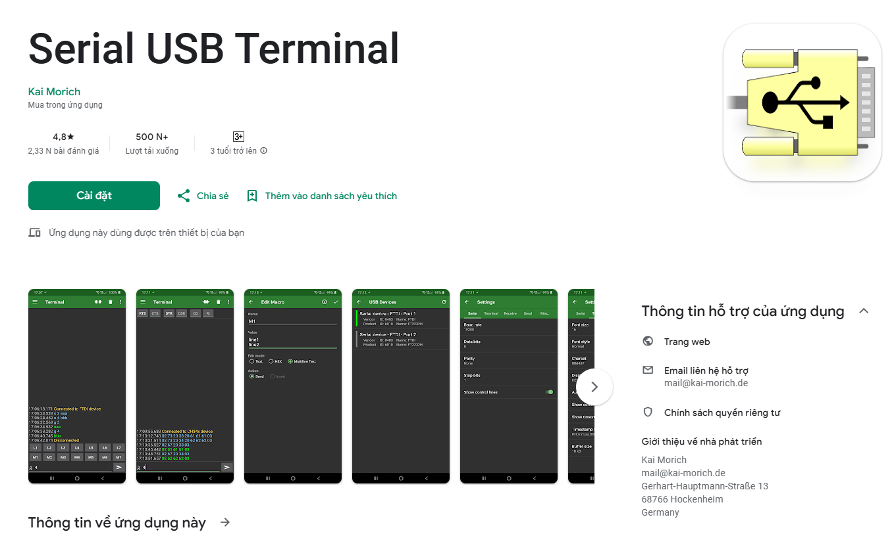

<div align="center">
  

# Final Project Nhóm 3 IOT102_SE1957_SUM25 - Hệ thống định vị hỗ trợ tìm kiếm cứu nạn khẩn cấp
</div>

<body>
  
## Bối cảnh
Ngày nay thiên tai ngày càng khó lường: 
- sự gia tăng của nhiều hiện tượng thời tiết cực đoan như lũ quét, sạt lở đất (thường xảy ra ở vn) và các hiện tượng hiếm thấy ở vn nhưng ngày càng xuất hiện như động đất, siêu bão vv...

## Vấn đề phát sinh
Làm tăng rủi ro cho nhân dân ở các vùng đồi núi nguy hiểm.
- khi sự cố xảy ra, đội cứu hộ cũng sẽ gặp rất nhiều rủi ro khi làm công tác cứu hộ
- trên thực tế,đã có không ít vụ những chiến sĩ cứu hộ đã phải hy sinh vì địa hình hiểm trở và thảm họa ập tới bất ngờ vv..
- [Ví dụ điển hình](https://thanhnien.vn/sat-lo-rao-trang-3-13-can-bo-hy-sinh-trong-khi-lam-nhiem-vu-tim-kiem-cuu-nan-1851002961.htm)
- công tác cứu hộ ở các vùng bị thiên tai còn gặp nhiều khó khăn, cứu nạn cứu hộ vẫn mất rất nhiều thời gian để cỏ thể xác định vị trí cũng như phải đảm bảo an toàn cho đơn vị ứng cứu

## Giải pháp
- thiết kế ra một thiết bị giúp đảm bảo kết nối giữa cơ quan chức năng của địa phương với nhân dân vùng có nhiều thiên tai nguy hiểm
- trong tình huống xấu nhất thì có thể xác định được vị trí chính xác của nạn nhân để kịp thời ứng cứu
- rút ngắn thới gian tìm kiếm cũng như có thể tăng cơ hội sỗng xót cho nạn nhân
- đảm bảo liên lạc dễ dàng giữa các thành viên trong độ cứu hộ với nhau

## Bất cập
- người dân chưa được trang bị những thiết bị cần thiết để ứng phó với thiên tai
- đội cứu hộ vẫn sử dụng các thiết bị truyền thống như điện thoại, bộ đàm hoặc có khi không được trang bị những thiết bị cơ bản để định vị, chưa thể xác định chính xác vị trí của nạn nhân cũng như vị trí của đòng đội đang hỗ trợ công tác ứng cứu
- chưa có một giải pháp cụ thể để liên lạc và định vị chĩnh xác nhằm đảm bảo an toàn cho người cứu hộ

## Nhóm 3 quyết định triển khai nghiên cứu dự án iot: “Hệ thống định vị hỗ trợ tìm kiếm cứu nạn khẩn cấp” 
- Nhằm đảm xác định vị trí nạn nhân nhanh nhất để thực hiện ứng cứu
- đảm bảo an toàn cho đội cứu hộ khi thực hiện công tác cứu hộ

## Mục tiêu
- TH1: tạo kết nối giữa người cứu hộ và nạn nhân (nếu có) - hỗ trợ xác định vị trí nhanh chóng nhất
- TH2: kết nối giữa đội cứu hộ và ban chỉ huy: đảm bảo an toàn cho đội cứu hộ

## Triển khai nghiên cứu
Yêu cầu hệ thống
Có 2 module: module định vị và module điều khiển <br/>
        - Module định vị:<br/>
               + Thành phần chính<br/>
                      - có thể định vị được GPS để biêt vị trí                                           > NEO 6M GPS ✅<br/>
                      - hiển thị được thông tin lên màn hình                                         > 0.96 oled 128x32 I2C (màn hình hiển thị) ✅<br/>
                      - có thể thu và nhận tín hiệu radio trong bán kính 1-2km       >  NRF24L01  ✅                               <br/>
                      - phát hiện té ngã                                                                                 > MPU-6050 ✅<br/>
                      - phát cảnh báo bằng âm thanh đủ lớn                                         > high db buzzer<br/>
                                                                                                                                         > ESP8266 ✅<br/>
               + Thành phần phụ<br/>
                      - có đèn chiếu sáng<br/>
                      - pin chạy được khoảng 7-8 tiếng<br/>
                      - có thể dùng năng lượng mặt trời để sạc<br/>
                      - la bàn (không bắt buộc)<br/>
                      - có thể hỗ trợ cảm biến khí ga dành cho thợ mỏ (có thể thêm vào module định vị)<br/>
         - Module điều khiển<br/>
                      - LCD để hiện khoảng cách hoặc tọa độ                                        > 16x2LCD<br/>
                      - thiết bị thu phat radio                                                                     > SX1278 thay bằng NRF24L01 <br/>

<br/>

## Video tham khảo:
<br/>
[ESP8266 Blynk GPS Tracker With Real Time Display](https://www.youtube.com/watch?v=UzTMUVmO7dM&t=326s)<br/>
[LoRa GPS Tracker Project with Google Maps - Arduino ESP8266 RYLR406](https://www.youtube.com/watch?v=XNE0Qm0NdLg)<br/>
[Track Your Dog Using Arduino | GPS + LoRa + Android](https://www.youtube.com/watch?v=u0pzo9lmS90)<br/>
[Arduino ESP32 GPS Data Visualization | Serial Communication and Android App](https://www.youtube.com/watch?v=jKTF34ZZt1I)<br/>
[How to Load HTML CSS Javascript Website Inside Unity3D for Free | Unity Android Tutorial](https://www.youtube.com/watch?v=pQbiWWvL8Co&t=56s)<br/>
[base code mẫu để tham khảo](https://github.com/ahmadlogs/LoRaGpsTracker)<br/>

## Brain dump
[Canva whiteboard ideas dump link](https://www.canva.com/design/DAGqHmEINVc/SHOX6dJeYkdIJgKQLLeZ7g/edit?utm_content=DAGqHmEINVc&utm_campaign=designshare&utm_medium=link2&utm_source=sharebutton)

## Sơ đồ Wiring cho 2 module

</body>

## Chức năng ngoài:
- Kết nối với app trên điện thoại thông qua OTG USB
- Chức năng : hình ảnh trực qua gps trên map
- Giao thức: Đọc tín hiệu serial gửi từ arduino qua OTG USB


- Logic giao tiếp qua serial:

```cpp
---
// The script is written by Slavko Zdravevski
// If you want to support my work, you can subscribe to my youtube channel: https://bit.ly/3FG9hpK
// I do a lot of interesting things in my free time, so you might find something of your interest or we can exchange ideas and knowledge

//The script works in combination with my android app. If you are using a GPS module with your microcontroller, you might wanna visualize the data that the module returns
//If that's the case you can use my app, and change the serial commands with the data that your module will give you
void setup() {
  Serial.begin(115200);
}

void loop() {
  //I just wrote a random map point, just to show you how it works, change the code and send your coordinates to the phone
  Serial.write("41.037806805413965,21.34574775323119|"); //My app expects: "latitude,longitude|" do not forget the "|" after the coordinates
  Serial.flush();
  delay(5000);
  Serial.write("41.03511284027609,21.339848139262262|");
  Serial.flush();
  delay(5000);
  Serial.write("41.032318982233626,21.335615232425358|");
  Serial.flush();
  delay(5000);
  Serial.write("41.03178015306117,21.330191820376996|");
  Serial.flush();
  delay(5000);
  Serial.write("41.03215932956679,21.322149297386886|");
  Serial.flush();
  delay(5000);
  Serial.write("41.03285780691883,21.316170316308956|");
  Serial.flush();
  delay(5000);
}
---
```

### App dùng để debug OTG USB


- Định dạng serial đầu ra đúng:
```txt
---

23:31:24.586 USB device detected
23:32:26.773 Connected to CDC device
23:32:26.774 �^K"Receiver V11 (App Compatible Mode) Initialized
23:32:30.035
21.471338,105.377510|21.471338,105.377510|
21.471346,105.377520|21.471346,105.377520|
21.471357,105.377520|21.471357,105.377520|
21.471367,105.377530|21.471367,105.377530|
21.471373,105.377530|21.471373,105.377530|
21.471378,105.377530|21.471378,105.377530|
21.471390,105.377540|21.471390,105.377540|
21.471401,105.377540|21.471401,105.377540|
21.471409,105.377540|21.471409,105.377540|
21.471416,105.377550|21.471416,105.377550|
21.471422,105.377550|21.471422,105.377550|
21.471426,105.377550|21.471426,105.377550|
21.471432,105.377550|21.471432,105.377550|
21.471439,105.377550|21.471439,105.377550|
21.471439,105.377550|21.471445,105.377550|
21.471445,105.377550|21.471449,105.377550|
21.471449,105.377550|21.471451,105.377550|
21.471451,105.377550|21.471453,105.377550|
21.471453,105.377550|21.471451,105.377540|
21.471451,105.377540|21.471453,105.377540|
21.471453,105.377540|21.471451,105.377530|
21.471453,105.377530|21.471453,105.377530|
21.471451,105.377530|
23:32:53.932 Disconnected

---
```